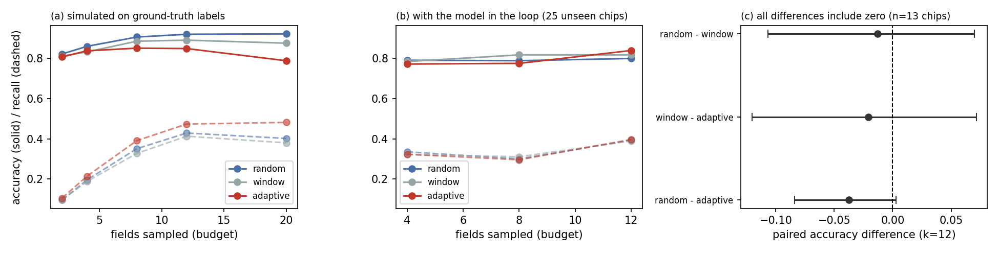
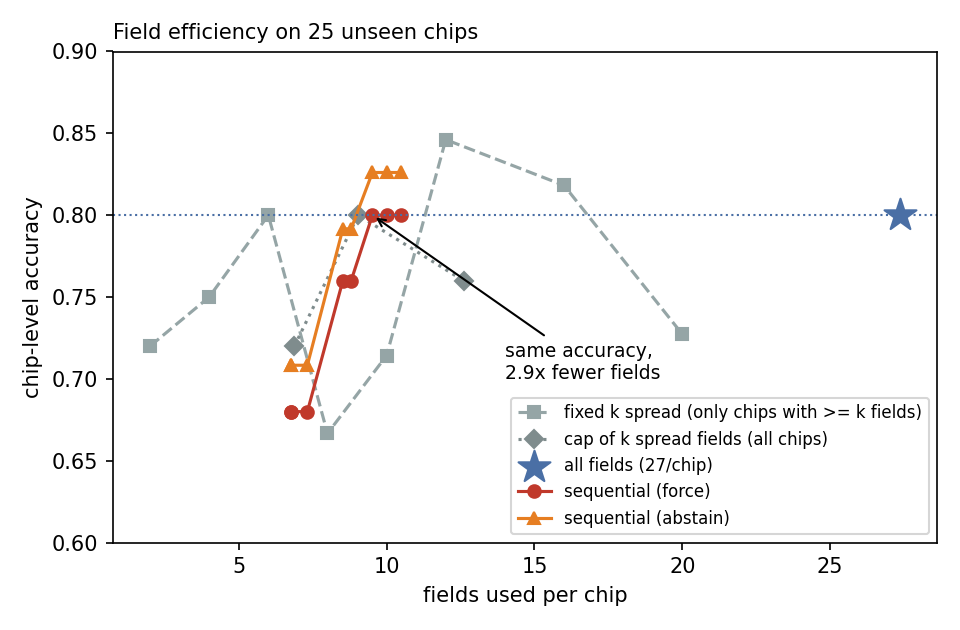

# When is one field enough?

**A measurement audit of an organ-on-a-chip quality-control benchmark, a corrected evaluation
protocol, and a chip-level QC tool with an explicit "inconclusive" outcome.**

*Category: Tool & Platform* — AI4S Open Innovation (AI + Organ-on-a-Chip), 2026.

| | |
|---|---|
| Team | **solo ranker** (individual) |
| Member | Taewoong Kim (independent researcher, South Korea) |
| Kaggle | `aleaiest` |
| Code, video, demo | https://github.com/Foreist/when-is-one-field-enough · video https://taewoong23-ooc-chip-qc-demo.static.hf.space/video.html · browser demo in §6.8 |

---

## Summary

Organ-on-a-chip (OoC) cultures are inspected daily under a microscope, and the quality-control
(QC) decision — keep the chip, re-image, or discard it — is still made by eye. A public benchmark
exists for automating this: the **OOC Image Dataset** (3,072 brightfield fields, 59 acquisition
sessions, six cell lines, labels from four expert cell biologists by majority vote). Before
building on it we asked a simple question: *is this benchmark measuring what it claims to measure?*

It is not, in three specific and measurable ways.

1. **The published split leaks sessions.** Training and test images come from the *same 57 of 59
   sessions*. Holding the test images and the training-set size fixed, and changing only whether
   the test sessions also contribute training images, moves accuracy by **+7.9 pp (95% CI
   4.2–11.5) and AUC by +8.9 pp (95% CI 6.7–11.0)** across eight seeds. The shipped split reports
   78.9%; the same model on unseen sessions reports 56.0%.
2. **The 3,072 labels are not 3,072 independent observations.** Labels are strongly autocorrelated
   along the acquisition order (session ICC 0.321, mean run length 6.08 fields versus 2.03 under
   independence). The design effect is 17, so the benchmark carries the information of roughly
   **181 independent labels** — and a single field agrees with the session's majority label only
   **78.8%** of the time (91.0% even with ten fields).
3. **The failure mode is spatial, not per-image — and our own policy comparison did not survive
   its own criticism.** Failures occupy contiguous stretches of a chip (runs test significant in
   23/45 mixed sessions, surviving a cell-type control). A policy comparison simulated on the
   *labels* suggests random fields are best for the chip call; **with the model in the loop that
   ranking disappears** — over 13–15 chips no paired difference survives a correction for the six
   comparisons made (§4.3). What does survive is a concrete, reproducible failure: reading the **first** *k*
   fields called a 100%-bad chip *pass* with 0.94 confidence, because the start of a session can
   sit inside a good region. The shipped tool samples fields spread across the chip for that
   reason, not on the strength of a policy ranking.

4. **The leakage is not unique to this benchmark.** Auditing a second public organoid imaging
   benchmark (OCT organoid tracking, zenodo.15783866) shows the same defect: **40.0% of its test
   files belong to a (well, day) acquisition group that also appears in training** (§4.4).

We then built the tool the corrected protocol implies, and measured what it buys: on 25 unseen
chips it reaches the same chip-level accuracy as reading **every** field (0.800) while using **9.5
fields instead of 27.4** — a 2.9× reduction in microscope time — and defers 8% of chips to a human
rather than guessing. Fields are sampled **spread across the
chip** (reading the first *k* can sit inside a good region and stop early — we observed a 100%-bad
chip called *pass* with 0.94 confidence), and a sequential stopping rule returns **pass / fail /
inconclusive** with a posterior confidence. On 25 unseen chips: **82.6% chip-level accuracy on the
chips it calls (23 of 25), 13% of calls confident-but-wrong, 8% inconclusive, 9.5 fields on average**. A plain cap
of 12 spread fields per chip does as well on field count (9.0 on average, 0.800); the saving comes
from not reading every field, and what the sequential rule adds is a posterior confidence and the
option to defer. The 8-field minimum behind these numbers was tuned on the same 25 chips; re-selected
by cross-validation on the other 34 sessions it would be 1, which scores 0.680 here (§6.2(c)). On those
independent chips the rule still matches reading every field with a fifth to two-fifths of the fields.

We also report two things we could not do, because they define the honest boundary of this work:
the **re-image vs discard** distinction is *not* supported by the data (a constructed recovery
target is not predictable; CV AUC 0.613 against a permutation null of 0.564), and **no reliable
out-of-distribution detector** was found (image statistics and feature-space distance both missed
the worst failure). Finally, simulating a stopping rule on ground-truth labels **overstates** it:
on the same 25 chips, without a minimum-field guard, labels give 0.875 and the model 0.708.

Everything is reproducible from one public dataset with the scripts in this repository.

---

## 1. Introduction

### 1.1 The problem

Microphysiological systems — organ-on-a-chip, organoids in microfluidic devices — are promoted as
human-relevant alternatives to animal testing. Their practical bottleneck is not the biology but
the *bookkeeping*: a chip is imaged repeatedly over days, and at each session someone must decide
whether the field in front of them is usable. Technical artifacts (air bubbles, defocus, deformed
channel walls) and biological problems (cells not attaching, density far from the expected range)
both appear as "bad", and both are judged by eye, field by field.

Automating this judgement is attractive, and a public benchmark for it exists. But an automated QC
system inherits every property of its benchmark: if the benchmark's split leaks, reported accuracy
is inflated; if its labels are clustered, its effective sample size is far smaller than it looks;
if its labels are field-dependent, then "accuracy per image" is not the quantity a lab actually
needs. None of these properties are usually checked.

**Who this is for.** (i) *Chip and organoid labs* that image cultures daily and decide keep /
re-image / discard by eye; (ii) *imaging and data teams* building reusable, trustworthy culture
datasets; (iii) *assays downstream of QC* — dose-response, toxicity, drug evaluation — which inherit
the quality of the fields that were kept.

### 1.2 What this report does

We take one public OoC QC benchmark — the OOC Image Dataset [1,2] — and treat the benchmark itself
as the object of study. We (i) audit its split and label structure, (ii) derive and validate a
corrected evaluation protocol, (iii) measure how sampling and aggregation policies behave on the
measured structure, and (iv) build a chip-level QC tool and evaluate it on held-out sessions,
reporting which of its settings were chosen on the test chips (§6.2(c)).

### 1.3 What we claim — and what we do not

We claim **measurement results** about a specific benchmark and a **protocol/tool** that follows
from them. We do *not* claim a new model architecture, biological or clinical validity, or
generalisation beyond this dataset. Leakage and label clustering are known phenomena in machine
learning [7–11]; our contribution is not their discovery but their **measured magnitude in
this benchmark, the corrected protocol, and the field-sampling policy we adopted after one observed
failure** — together with two negative results that bound the claims. The policy is not a measured
optimum: a ranking of sampling policies did not survive the model in the loop (§4.3).

---

## 2. Data

**Source.** OOC Image Dataset, Zenodo record `10.5281/zenodo.10203721` [3]; data descriptor in *Data*
2024 [1] and a companion conference paper [2]. The Zenodo record states **CC-BY-4.0**; the MDPI
descriptor lists **CC-BY-SA**. We resolve the ambiguity conservatively: we redistribute no images
beyond the 44 attributed demo example fields, license our code MIT and our derived artefacts
CC-BY-SA.

**Content.** 3,072 brightfield images (2,056 × 1,542 px) from an automated microscope on an OoC
setup, covering six cell lines (A549, Caco-2, HPMEC, HUVEC, NHBE, HSAEC). Filenames are
`YYMMDD_N.png`: `YYMMDD` identifies an **acquisition session** (59 in total) and `N` the field
number within it. Each image carries a binary label, `good` or `bad`, assigned by **four expert
cell biologists**, with disagreement resolved by majority vote or an additional rater [1].
Metadata (cell type, seeding density, flow rate, day after seeding) is available for part of the
data. Figure 1 summarises the corpus: sessions range from 6 to 229 fields (median 24), and the
share of fields labelled `bad` ranges from 0% to 100% per session.


*Figure 1. The corpus. (a) fields per session; (b) per-session share of fields labelled `bad`.*

**The published split.** The zip ships `train/val/test` folders (2,130 / 286 / 656 images). This is
the split used by the reference baseline in [1].

**Privacy, ethics and compliance.** The dataset contains brightfield images of immortalised cell
lines grown in microfluidic devices. There are no human subjects, no patient-derived material, no
identifiable personal data and no clinical records, so no consent or IRB review applies; the data
are distributed publicly under the licences above. The tool automates a quality judgement about an
image — it makes no biological, diagnostic or clinical claim, and we do not use it to make
decisions about patient material. The second benchmark audited in §4.4 is likewise public
(CC-BY-4.0) and contains only instrument images.

---

## 3. Methods

All quantities below are defined once here and used unchanged throughout; the scripts that compute
them are listed in §10.

**Sessions and fields.** A *session* is one acquisition date (`YYMMDD` in the filename) — one
microscope run over one or more chips. A *field* is one image. We treat the field index `N` as the
acquisition order; the proxy is supported by the high correlation between consecutive fields
(§4.2). A *run* is a maximal contiguous block of equal labels in field order.

**Runs test (clustering).** For a binary sequence with `n₁` bad and `n₀` good fields, the number of
runs `R` has, under independence, mean `μ = 2n₁n₀/n + 1` and variance
`σ² = 2n₁n₀(2n₁n₀ − n) / (n²(n − 1))`; we report `z = (R − μ)/σ` and the two-sided normal p-value.
Negative `z` means fewer runs than chance, i.e. clustering. Sessions without both labels are
skipped. The i.i.d. expected run length is `1 / (2p(1−p))` with `p` the observed good fraction.

**Intraclass correlation and design effect.** For clusters (sessions) with sizes `n_i`, ICC(1) is
estimated by one-way ANOVA, `ICC = (MSB − MSW) / (MSB + (m₀ − 1)·MSW)` with
`m₀ = (N − Σn_i²/N)/(k − 1)`; the design effect is `1 + (m₀ − 1)·ICC` and the effective sample size
is `N / design effect`. This is the standard cluster-sampling treatment of "images within a chip".

**Controlled leakage A/B.** Test images are fixed by choosing 20 sessions and withholding half of
each session's fields as the test set. The other half of those sessions' fields are *available* but
used only in the leaky arm. Both arms receive exactly `N` training fields (`N` = the non-test pool minus the 200 shared
validation fields): the disjoint arm draws
all `N` from non-test sessions; the leaky arm draws `N − k` from non-test sessions and `k` from the
available test-session fields. Model, budget, augmentation and seeds are identical.

**Chip-level decision.** For a set of fields with per-field bad probabilities `p_j`, the sequential
rule maintains a Beta(1,1) posterior on the bad fraction `f` — `f | data ~ Beta(1 + b, 1 + g)` with
`b`, `g` the counts of fields with `p_j > 0.5` and `≤ 0.5` — and stops as soon as
`P(f > 0.5) > 0.9` or `P(f < 0.5) > 0.9`, at most after a budget of 20 fields and never before
`min_fields`. If the budget is exhausted with `0.35 < P(f > 0.5) < 0.65`, the call is
**inconclusive** rather than forced. The confidence 0.9 and budget 20 were fixed in the label-only
simulation (`audit/stopping_rule.py`) before any model existed, and the ±0.15 band is a round
number that was never tuned; none of the three was varied on the test chips. `min_fields` was, and
§6.2 reports how it was re-selected without them.

**Spread-field order.** With `n` available fields and a budget of `k`, the rule inspects indices
`round(i·(n−1)/(k−1))` for `i = 0…k−1`, i.e. fields spaced evenly across the acquisition order. This
replaces "the first `k` fields" after the failure described in §6.2.

**Metrics.** *Field accuracy* is the fraction of fields whose predicted side of 0.5 matches the
expert label. *Chip reference* is the session's majority label (a tie counts as `good`; one test
chip, 220606, is tied). *Chip accuracy among called
chips* counts every chip that received a *pass* or *fail* — whether the rule stopped at confidence
≥ 0.9 or exhausted the budget outside the inconclusive band; *false-confident rate* is the fraction
of called chips whose call was wrong with posterior confidence ≥ 0.9; *inconclusive rate* is the
fraction that exhausted the budget near 0.5. *Bad-region recall* (sampling simulations) is the
fraction of the session's bad fields that the sampled set contains.

**Evaluation discipline.** Every model number in this report comes from a **session-disjoint** test
set of 25 sessions (684 fields). These are the withheld half of each held-out session's fields (the
controlled-leakage design sets the other half aside; it is never used for training), so a "test
chip" is a random half of a session; §6.4 repeats the tool on all 1,377 fields of the same sessions. Where we also report the shipped split's number, it is labelled as
such. Training hyperparameters were fixed before the final evaluation. One
decision-rule setting was not: the `min_fields` guard was read off these chips, and §6.2(c)
re-selects it without them.

---

## 4. Audit

### 4.1 The published split leaks sessions

**Observation.** Parsing the archive's central directory shows the split is image-level: sessions
are not held out. **Train contains 59 sessions, validation 51, test 57, and train ∩ test = 57 of
59 sessions** — images of the same chip, acquired in the same session, appear on both sides.

**Controlled measurement.** A plain comparison of splits confounds leakage with differences in test
composition, so we hold everything else fixed:

* the **test images** are identical in both arms (20 sessions, 494–712 fields depending on the seed);
* the **training-set size is identical** in the two arms (1,440–1,876 fields depending on the seed; the
  200 validation fields are identical too and outside both training sets);
* the **model and budget are identical** (MobileNetV3-small [4], ImageNet-initialised, 6 epochs, 224 px);
* the only difference is whether the training set may use *the other images of the test sessions*
  (leaky; they make up 27–50% of its training fields, depending on the seed) or must come from
  disjoint sessions (disjoint).

| arm | accuracy | AUC |
|---|---|---|
| session-disjoint (mean ± s.d. over seeds) | **67.4%** (± 6.8 pp) | **0.753** |
| same sessions in training (leaky) | **75.2%** (± 3.3 pp) | **0.842** |
| **inflation** (paired, 8 seeds) | **+7.9 pp** [4.2, 11.5] | **+8.9 pp** [6.7, 11.0] |


*Figure 2. (a) controlled A/B (8 seeds; paired inflation +7.9 pp accuracy, +8.9 pp AUC; positive in every seed — accuracy 4.2–17.8 pp, AUC 6.7–15.0 pp — and the AUC gain grows with the leaked share, r = 0.74); (b) shipped vs session-grouped split.*

For reference, the shipped split yields **78.9% ± 0.07 pp / AUC 0.873** (mean ± s.d. over three
seeds; the variation is tiny because all test sessions are seen in training), while a
session-grouped split that keeps all six cell lines yields **56.0% ± 7.2 pp / AUC 0.684** — a 22.9 pp gap that mixes leakage with the small
number of held-out sessions (six). We therefore treat the **controlled A/B as the headline number**
and report the shipped/grouped pair only as context.

**Why this matters for the benchmark.** Any model compared on the shipped split is compared on a
test set whose sessions it has already seen. Model *rankings* may survive (the leak affects all
models similarly), but the *absolute* numbers, and any claim of "generalisation to new chips", do
not.

### 4.2 Labels are clustered along the acquisition order

**Runs test.** For each session we take the label sequence in field order and count runs (maximal
contiguous blocks of equal label). Under independence the expected run length is
`1 / (2 p (1-p))`; with `p ≈ 0.56` that is **2.03** fields. Observed: **6.08**. A Wald–Wolfowitz
test is significant (p < 0.05) in **23 of the 45 mixed sessions**, and 36/45 have negative z
(clustered) — against 22.5 expected by chance. The most extreme session has z = −11.9 (21 runs
where 107.3 were expected, 215 fields).

| session | fields | good share | runs | expected runs | z | p |
|---|---|---|---|---|---|---|
| 230425 | 215 | 0.55 | 21 | 107.3 | -11.93 | <1e-6 |
| 230419 | 124 | 0.07 | 2 | 16.0 | -10.71 | <1e-6 |
| 230320 | 229 | 0.77 | 27 | 82.5 | -10.34 | <1e-6 |
| 230529 | 216 | 0.43 | 48 | 106.6 | -8.18 | <1e-6 |
| 230317 | 100 | 0.73 | 10 | 40.4 | -7.78 | <1e-6 |
| 230315 | 94 | 0.55 | 13 | 47.5 | -7.23 | <1e-6 |
| 230517 | 90 | 0.60 | 12 | 44.2 | -7.11 | <1e-6 |
| 230314 | 50 | 0.44 | 3 | 25.6 | -6.57 | <1e-6 |
| 230424 | 108 | 0.51 | 21 | 55.0 | -6.57 | <1e-6 |

*Table 1. The nine most clustered sessions, by z (the last two tie; 15 of the 45 mixed sessions have p < 1e-6). Expected runs are what independence would give for the same good/bad counts.*

**This is not a cell-type artifact.** A session can contain several cell types imaged in contiguous
blocks, which would create clustering for trivial reasons. Restricting the test to *maximal
contiguous same-cell-type stretches* (at least 8 fields and both labels present; 72 stretches from
41 sessions), **38 of 72 remain significant** (57/72 clustered).

**It is not duplicate frames either.** In the six largest sessions, downscaled correlation between
consecutive fields is 0.58–0.74 (random pairs in the same sessions: 0.06–0.36; over the six largest
and six smallest sessions, mean 0.54 vs 0.28), i.e. consecutive fields are spatially adjacent — but
counting a new view whenever a field's correlation with the previous one falls below 0.95 gives
**1,161 distinct views among 1,183 images (98%)**. The clustering
is therefore not redundancy; **failures occupy contiguous regions of the chip**.

**Effective sample size.** With a session-level intraclass correlation of **ICC = 0.321** and an ANOVA-adjusted mean
cluster size of m ≈ 51 fields, the design effect is `1 + (m−1)·ICC = 17.0`, so for estimating a metric
the benchmark carries the information of roughly **3,072 / 17 ≈ 181 independent labels** (a model
may still exploit correlated fields in ways an estimator cannot, so this is a bound on
*estimation*, not on learning). The mean lag-1 autocorrelation
is 0.32 (53% of sessions above 0.3).


*Figure 3. (a) runs-test z per session; (b) observed versus i.i.d. run length; (c) ICC, design
effect and effective sample size.*

Agreement degrades with culture age and is cell-line dependent:

| culture age | fields | single-field agreement |
|---|---|---|
| 0-1_days | 852 | 0.805 |
| 2-3_days | 798 | 0.779 |
| 4+_days | 1199 | 0.676 |
| 4_days | 223 | 0.704 |

| cell line | fields | single-field agreement |
|---|---|---|
| A549 | 775 | 0.710 |
| CACO | 346 | 0.792 |
| HPMEC | 1462 | 0.702 |
| HSAEC | 244 | 0.840 |
| HUVEC | 107 | 0.991 |
| NHBE | 138 | 0.826 |

*Table 2. Single-field agreement with the session's majority label, by culture age and cell line, counting every field once (74.1% over all 3,072 fields; the 78.8% in the text gives each session equal weight, see below). Late cultures are the hardest, and no cell line is uniformly easy.*

**Consequence for labels, not just for statistics.** If the label were a property of the chip, a
single field would predict the session's majority label almost perfectly. It does not: a randomly
drawn field agrees with the session majority **78.8%** of the time, three fields 84.1%, five 87.4%, and
even ten fields only **91.0%** (up to 50 random draws per session, so each session weighs about
equally; counting every field once instead gives 74.1% for one field). Agreement is worse for late cultures (4+ days: 67.6% for a single
field) than for day 0–1 (80.5%). The "quality" of a chip is therefore **a property of a region and
of the sampling**, not of an image.

### 4.3 Sampling policy: a comparison that does not survive the model in the loop

If failures are contiguous, how should fields be chosen? We first simulate three policies on the
measured **label sequences** at a fixed budget *k* (300 trials per session):

* **random** — *k* distinct uniform fields;
* **window** — one contiguous run of *k* fields (a scan);
* **adaptive** — start at a random field; if it was `bad`, expand to an unsampled neighbour; if
  `good`, jump elsewhere.

| budget k | random: acc / recall / err | window: acc / recall / err | adaptive: acc / recall / err |
|---|---|---|---|
| 2 | 0.777 / 0.098 / 0.182 | 0.787 / 0.095 / 0.220 | 0.772 / 0.103 / 0.203 |
| 4 | 0.835 / 0.197 / 0.119 | 0.819 / 0.186 / 0.173 | 0.803 / 0.214 / 0.154 |
| 8 | 0.887 / 0.351 / 0.075 | 0.879 / 0.331 / 0.130 | 0.828 / 0.391 / 0.121 |
| 12 | 0.916 / 0.430 / 0.055 | 0.890 / 0.413 / 0.107 | 0.830 / 0.475 / 0.109 |
| 20 | 0.927 / 0.400 / 0.046 | 0.885 / 0.380 / 0.107 | 0.781 / 0.482 / 0.138 |

*Table 3. Label-based policy simulation. `err` = |estimated − true bad fraction|; a tied vote (even
k) is broken at random. Random looks best for the call from k = 4 and adaptive best for
localisation — and we do not believe this table.*

This is exactly the practice criticised in §6.7, so we repeat the comparison with the deployed
model's per-field probabilities on the 25 session-disjoint test chips
(`audit/03c_policy_model_in_loop.py`):

| budget k | random: acc / recall | window: acc / recall | adaptive: acc / recall |
|---|---|---|---|
| 4 | 0.791 / 0.335 | 0.785 / 0.321 | 0.772 / 0.323 |
| 8 | 0.789 / 0.300 | 0.818 / 0.311 | 0.776 / 0.296 |
| 12 | 0.800 / 0.393 | 0.818 / 0.389 | 0.840 / 0.397 |

*Table 4. The same policies with the model in the loop. The ordering changes — adaptive, the
label simulation's worst caller at k ≥ 8, is nominally best at k=12 — but nothing survives a
multiple-comparison correction. A paired bootstrap over chips (10,000 resamples,
`audit/03d_policy_bootstrap.py`) gives 95% intervals at k=12 (13 chips) of [−0.08, −0.00] for
random − adaptive, [−0.13, +0.07] for window − adaptive and [−0.13, +0.08] for random − window. The
first only just excludes zero and rests on the 4 of 13 chips where the two policies differ at all.
With a Bonferroni correction for the six differences tested (three pairs × k = 8, 12) no interval
excludes zero — that one's upper bound is exactly 0 (Figure 4c).*


*Figure 4. Policy comparison. (a) simulated on ground-truth labels; (b) with the model in the loop;
(c) paired bootstrap differences at k=12 — thick bars 95%, thin bars Bonferroni-corrected for six
comparisons; every corrected interval includes zero, so no ranking is claimed.*

**We therefore report no policy ranking.** With only 13–15 chips large enough for these budgets the
comparison is underpowered, and the label-based ranking is an artefact of scoring policies against
the very labels they were designed to sample.

What *is* established, and what the tool uses, is a single reproducible failure of the obvious
default. Reading the **first** *k* fields in acquisition order with the sequential rule of §6.1
called a 100%-bad chip (session 230405) *pass* with 0.94 confidence: the per-field probabilities in
the first third of that session are low (mean 0.255 over the first five fields, versus 0.935 over
the last twenty). Sampling fields spread across the chip fixes that case (the same chip returns
*fail*, P = 0.91); on the 11 chips with at least 20 fields the accuracy difference (0.727 vs 0.636)
is ±1 chip and is not significant either. The justification for spread sampling is the observed
failure, not a measured ranking.

### 4.4 The same defect in a second organoid benchmark

To test whether the leakage we measure is a property of one dataset or of the field, we audited a
second public organoid imaging benchmark: the **OCT organoid segmentation-and-tracking dataset**
(zenodo.15783866, CC-BY-4.0; Branciforti et al., *Diagnostics* 2024 [5,6]). Its file names encode the acquisition group —
`w<well>_d<day>_<slice>.png` in train/val and `d<day>_p<plate>_w<well>_<slice>.png` in test (all test
images are plate 1; train/val names carry no plate). If train/val come from the same plate — the
names give no other one — the same (well, day) means the same organoids imaged in the same session.
Reading the archive's central
directory over HTTP range requests (no 4.9 GB download; `audit/06_oct_leakage.py`):

* train: 5,584 images in **8** (well, day) groups; val: 1,396 images in 2 groups; test: 6,980 images in 10 groups
  (each image is stored three times — original, manual mask, automatic mask; we count originals)
* **train ∩ test = 4 groups** — well 2 at days 5, 7, 11 and 13; val ∩ test = 1 group
* **40.0% of test images (2,792 of 6,980) belong to a (well, day) group that also appears in training**

For a *tracking* benchmark this is more severe than for classification: under that reading the same
organoid instances, imaged in the same session at the same timepoint, appear on both sides of the
split. The file names cannot rule out a second plate with the same well numbering; the paper's own
split description would settle it. We report the
structural overlap rather than a re-trained inflation number, because re-training their
segmentation/tracking pipeline is out of scope here.

Two datasets, two independent instances of the same defect — group-level splits that leak — which is
the empirical basis for the first rule of the corrected protocol (§5).

### 4.5 A hypothesis we tested and rejected: re-image vs discard

The dataset's own definition of `bad` mixes **technical artifacts** (bubbles, defocus, deformed
walls) with **biological problems** (morphology/density off expectation) [1]. If these could be
separated, the actionable output would be "re-image" (cheap, the chip survives) versus "discard"
(expensive, re-imaging is useless). Two observations encouraged the attempt: isolated bad runs are
blurrier and darker than good fields (single-field runs: mean absolute gradient 0.089 vs 0.126;
dark fraction 0.137 vs 0.094 — bubbles and defocus), whereas long bad runs are sharper (0.150) and
higher in contrast (s.d. 0.243 vs 0.199; `audit/04b_run_image_stats.py`); and visually,
4/4 sampled isolated-bad fields showed bubbles or defocus.

We constructed a target — a run of `bad` fields "recovers" if at least three of the next five
fields are `good`; runs followed by fewer than five fields, including the 30 of 250 that reach the
end of the session, count as not recovering (base rate 62.4%) — and tried
to predict it from features available at decision time (run length, whether the run reaches the end
of the session, focus, darkness, artifact scores), with **session-grouped cross-validation**.

| feature set | CV AUC |
|---|---|
| run length only | 0.476 |
| artifact signals only | 0.381 |
| run length + artifacts | 0.539 |
| all features | 0.613 |
| permutation null | mean 0.479, p95 **0.564** |
| simple rule (length ≤ 2 ⇒ recover) | accuracy 0.560 vs base rate **0.624** |

**The decision rule is not supported.** The target is confounded by position (because failures are
contiguous, the fields after a run are usually good, so "recovery" largely means "the run did not
reach the end"), and — more fundamentally — **no re-imaging was ever performed in this dataset, so
the causal question cannot be observed**. We therefore ship `pass`/`fail`/`inconclusive` and
document the two-mode observation as an *open problem*, not a feature.

### 4.6 Aggregation rules are a sensitivity/specificity dial

If several fields are read, their scores must be combined. We compare three rules on per-field
probabilities from a session-disjoint model (a lighter 224 px, 6-epoch model than the shipped one,
with its field threshold chosen on validation rather than the tool's 0.5), with the chip reference
defined as before:

| budget k | mean: acc / sens / spec | max: acc / sens / spec | top-2: acc / sens / spec |
|---|---|---|---|
| 1 | 0.704 / 0.456 / 0.832 | 0.704 / 0.456 / 0.832 | 0.704 / 0.456 / 0.832 |
| 3 | 0.691 / 0.475 / 0.803 | 0.699 / 0.691 / 0.704 | 0.709 / 0.610 / 0.760 |
| 5 | 0.678 / 0.493 / 0.767 | 0.626 / 0.686 / 0.598 | 0.627 / 0.574 / 0.653 |
| 8 | 0.742 / 0.645 / 0.787 | 0.627 / 0.878 / 0.507 | 0.660 / 0.787 / 0.598 |
| 12 | 0.742 / 0.851 / 0.710 | 0.570 / 1.000 / 0.354 | 0.631 / 0.997 / 0.452 |

*Table 5. Aggregation rules (2 seeds, each its own split of 25 held-out sessions; 60 random k-field draws per chip, shared by all rules; chips with < k fields excluded). Field thresholds, chosen on validation by balanced accuracy: 0.30 and 0.25.*

`mean` maximises chip accuracy and keeps specificity high; `max` maximises sensitivity (it calls
almost everything bad: specificity collapses to 0.35 at k=12) and `top-2` sits between. **The
aggregation rule moves the operating point more than the per-field model does** — at k=12, accuracy
ranges from 0.570 to 0.742 and sensitivity from 0.851 to 1.000 depending only on the rule. A QC
deployment must therefore state its aggregation rule; "accuracy" without it is not a specification.

We also tested a rule that exploits the measured autocorrelation — smoothing the per-field scores
along the acquisition order before aggregating. It did **not** help: on the shipped predictions a
3- or 5-field moving average changes chip accuracy by at most 0.007 at any budget from 4 to 12
fields (k=6: 0.792 → 0.795 with a 3-field and 0.793 with a 5-field window; `audit/smoothing_test.py`). Reported as a negative result.

### 4.7 Metadata does not explain the labels

A logistic model on day, log seeding density, flow rate and cell line reaches only 0.562 in-sample
accuracy, and apparent cell-line differences (Caco-2 68.5% bad vs NHBE 23.9%) dissolve on
inspection: every cell line has sessions with a 0% bad rate and sessions with 100%. The label is
dominated by **session-level** variation, consistent with §4.2.

---

## 5. Corrected evaluation protocol

From the audit, three rules follow for anyone training or benchmarking on this dataset:

1. **Split by session, not by image.** No session may contribute to two splits. Report the number
   of held-out sessions alongside the metric — with 59 sessions, a 20% held-out split is ~12
   sessions and the confidence interval on chip-level accuracy is correspondingly wide.
2. **Evaluate at the chip level.** Report (i) per-field accuracy/AUC *and* (ii) chip-level accuracy
   with the number of fields used, because per-field numbers do not answer the lab's question and
   are inflated by within-session correlation (effective N ≈ 181, not 3,072).
3. **State the sampling policy.** Which fields were used, and how many. Policies differ in
   principle (§4.3) and we could not rank them with this benchmark's 59 sessions; a number is only
   interpretable together with the policy that produced it.

As a worked example, the scripts listed in §10 reproduce every number in this report from the raw
dataset.

---

## 6. The tool

### 6.1 Design

`inference.py` takes the fields of one chip (filenames in acquisition order) and returns:

* **per-field P(bad)** from a MobileNetV3-small (ImageNet-initialised, 384 px, 25 epochs, cosine
  LR, label smoothing, random-resized-crop/flip augmentation), trained on a **session-disjoint**
  split (1,495 train / 200 val / 684 test fields from 25 unseen sessions);
* a **chip call** — `pass`, `fail`, or `inconclusive` — from a Beta(1,1) posterior on the bad
  fraction, stopping when `P(chip bad) > 0.9` or `< 0.1`;
* **how many fields were needed**, with fields chosen **spread across the chip** rather than the
  first *k*;
* a **QC map** (field index vs P(bad)) and a `chip_report.json`.

**Model and training.** MobileNetV3-small [4], ImageNet-initialised, classifier head replaced with a
2-way linear layer. Input 384 × 384 (the source images are 2,056 × 1,542). AdamW (lr 3e-4, weight
decay 0.02), cosine schedule to lr/30, label smoothing 0.05, batch 32, 25 epochs
(≈14 s/epoch on one RTX 3090, ≈6 min total), RandomResizedCrop(0.7–1.0) + horizontal/vertical
flips. Label smoothing and the modest capacity are deliberate: the labels are four-rater
majorities, and 3,072 fields with an effective N of ~181 do not support a large model. The
checkpoint is shipped in `model/`.

### 6.2 Two bugs found during deployment, and how their fixes were chosen

Deploying the tool on real chips exposed two failure modes that a label-only simulation had hidden.

**(a) Reading the first *k* fields is wrong.** On a 100%-bad chip, walking the first fields in
acquisition order stopped after six fields (five `good` predictions, one `bad`) and returned *pass*
with 0.94 confidence.
Because failures are contiguous (§4.2), the beginning of a session can lie inside a good region.
Sampling fields spread across the chip fixed this specific case (the same chip now returns *fail*
at 0.91).

**(b) The Beta posterior is overconfident on few fields.** With three `good` fields and no `bad`
one, `P(chip bad) = 0.0625` — "94% confident" — which is indefensible when the per-field model is
imperfect. Requiring a minimum of eight fields before a stop is allowed cut the false-confident
rate from 25% to 13%.

**(c) The value 8 was read off the test chips, and it does not survive re-selection.** Both fixes
above were found *on* the 25 test chips, and the minimum of eight was chosen from a sweep on them
(Figure 5). To see how much of the test gain is selection, we re-selected it without the test
chips (`audit/09_inner_cv_minfields.py`): five-fold session-grouped cross-validation over the 34
non-test sessions with the shipped training recipe, each session cut into two half-chips like the
test chips (68 chips), and a criterion fixed before looking — highest chip accuracy with every chip
called, ties to fewer fields.

| on 68 non-test chips (out-of-fold) | min 1 | min 8 | min 12 | all fields |
|---|---|---|---|---|
| chip accuracy, every chip called | 0.779 | 0.765 | 0.765 | 0.765 |
| confident-but-wrong chips | 11 | 10 | 8 | — |
| fields per chip | 5.3 | 8.1 | 9.9 | 24.9 |

The criterion selects **min 1**, whose test result is **0.680** with every chip called (0.708 on the
24 it calls, 6.8 fields). The guard's accuracy gain on the test chips (0.680 → 0.800) is therefore
not reproduced on independent chips and should be read as optimistic; on those chips the guard only
trims confident errors (11 → 8 of 68 at min 12) for one chip of accuracy. What *does* replicate is
the efficiency claim: at every minimum the rule matches reading every field (0.765–0.779 versus
0.765) with 5.3–9.9 fields instead of 24.9, and in the deferring mode it is 0.806 on the 62 of 68
chips it calls at min 8 (0.800 on 65 at min 1) — close to the 0.826 measured on the test chips. We keep min 8 in the tool for the a-priori reason in (b)
— three agreeing fields cannot justify 94% — and report the test-chip numbers at 8 below with this
caveat. The same re-selection picks the plain cap of Table 6 as **20**, not 12 (0.765 on the 68
chips, 0.760 on the test chips with 12.6 fields), and reading the first fields instead of spread
ones is no better there (0.750 vs 0.765 at min 8): the spread order is kept for the failure in (a),
not for a measured gain.

### 6.3 Measured performance (25 unseen chips, 684 fields)

| metric | value |
|---|---|
| per-field accuracy / AUC | 0.734 / 0.791 |
| chip accuracy, all fields, mean | 0.80 |
| **chip accuracy among called chips** (spread fields, min 8 — tuned on these chips, §6.2(c)) | **0.826** (95% Wilson CI 0.63–0.93, n=23) |
| **false-confident calls** (conf ≥ 0.9 and wrong, of 23 calls) | **13%** (3/23) |
| inconclusive (budget exhausted near P = 0.5) | 8% |
| mean fields used | **9.5** (a plain cap of 12 spread fields: 9.0 fields, 0.80) |


*Figure 5. Tool behaviour versus the minimum-fields guard, swept on the 25 test chips (the sweep
the value 8 was read from; §6.2(c) re-selects it without them). In (a) the sequential curve is
accuracy on the chips it calls (23–24 of 25); the grey curve is a cap of k spread fields on all 25.*

**Capacity is not the bottleneck.** We trained a backbone with 2.8× the parameters (MobileNetV3-large, same
384 px, same split and schedule; batch 8 instead of 32 to fit memory). Test field accuracy moved from 0.734 to 0.746 and balanced accuracy from
0.733 to 0.747, while AUC *fell* from 0.791 to 0.788 — i.e. a larger model buys nothing here
(`audit/perfield_model.py --arch large`). Higher resolution does not either: the small backbone at
512 px (batch 12) gives accuracy 0.734 and AUC 0.797 (`--size 512`). Together with the session-level shift in §6.5 (almost every unseen session sits outside the
training feature distribution) this
suggests the ceiling is set by the labels and by chip-to-chip appearance, not by model capacity.
We therefore ship the smaller model, which is cheaper to run; with the same stopping rule the larger
model uses the same 9.5 fields and is not more accurate on the chips it calls (0.792 vs 0.826).

### 6.4 Field efficiency: the same accuracy with 2.9× fewer fields

The naive way to use a per-field model is to read every field of the chip and average. On the 25 test
chips that costs **27.4 fields per chip for 0.800 accuracy**. The shipped rule — fields spread
across the chip, Beta posterior, stop at confidence 0.9, minimum 8 fields — reaches **0.800 on all
25 chips using 9.5 fields (2.9× fewer)**, and when it is allowed to defer the chips it cannot
resolve it reaches **0.826 on the 23 it calls, deferring 8%** (`audit/07_efficiency.py`):

| policy | fields per chip | chips called | accuracy |
|---|---|---|---|
| all fields (mean of every field) | 27.4 | 25/25 | 0.800 |
| fixed k = 12, spread (chips with ≥ 12 fields only) | 12.0 | 13/25 | 0.846 |
| cap of 12 spread fields (all fields if fewer) | 9.0 | 25/25 | 0.800 |
| **sequential, force** (min 8) | **9.5** | **25/25** | **0.800** |
| **sequential, abstain** (min 8) | **9.5** | 23/25 | **0.826** |

*Table 6. Field efficiency. The fixed-k row is evaluated only on the 13 chips that have at least 12
fields, so it is not comparable with the others; the cap and sequential rows use every chip. A plain
cap of 12 fields is as frugal as the sequential rule, but the right cap is only known after the fact
(a cap of 8 gives 0.720, a cap of 20 gives 0.760; selected without the test chips the cap would be
20, §6.2(c)). The min-8 rows share the same caveat: without the test chips the minimum would be 1,
which scores 0.680 here; the rule's contribution is the per-chip
confidence, the pass / fail / inconclusive call and the option to defer, not a further cut in fields.*


*Figure 6. Accuracy against the number of fields used per chip.*

For a lab imaging plates of chips this is the practical number: the decision costs roughly a third of
the microscope time of the read-everything workflow, and a further 8% of chips are flagged
"needs a human" instead of being guessed.

**Full sessions.** On all fields of the same 25 held-out sessions (1,377 fields, 55.1 per chip,
reference = full-session majority; `audit/08_full_sessions.py`) the saving grows and the accuracy
drops: reading every field gives 0.76, the shipped rule gives **0.76 with 9.0 fields (6.1× fewer)**,
but it defers no chip and 6 of its 25 calls are confident and wrong (min 10 or 12: 0.80, 11–12.6
fields). The half-session numbers above are therefore the favourable end.

The tool ships this as a **plate mode** (`inference.py --plate <folder>`; one subfolder per chip),
which returns a ranked triage table. On the 25 test chips it spends **238 of 684 fields (65%
saved)** and returns 6 *fail*, 2 *inconclusive* and 17 *pass*, worst first.

### 6.5 Where the tool fails

The model's own confidence does not flag chip-level failures: all four wrong calls in Table 7 were
made at confidence 0.89 or higher, three of them above the 0.9 stopping threshold. The clearest case is session 230405 (69 fields, **100%** labelled
bad): the model is right on 82.6% of its fields individually, yet the per-field probabilities in
the first third of the session are low (mean 0.255 over the first five fields versus 0.935 over the
last twenty), so an unguarded rule stopped early with a confident *pass*.

| chip | fields | bad share | field acc | | chip | fields | bad share | field acc |
|---|---|---|---|---|---|---|---|---|
| 220706 | 5 | 100% | 0.200 | | 220506 | 7 | 29% | 0.857 |
| 220718 | 4 | 100% | 0.750 | | 220715 | 7 | 29% | 0.429 |
| 220721 | 3 | 100% | 1.000 | | 230123 | 13 | 23% | 0.692 |
| 230405 | 69 | 100% | 0.826 | | 220515 | 6 | 17% | 0.833 |
| 230403 | 6 | 83% | 0.167 | | 230109 | 53 | 13% | 0.792 |
| 230314 | 25 | 64% | 0.720 | | 230214 | 24 | 12% | 0.667 |
| 230512 | 44 | 61% | 0.795 | | 220502 | 4 | 0% | 1.000 |
| 230529 | 108 | 59% | 0.769 | | 220620 | 6 | 0% | 1.000 |
| 230523 | 55 | 55% | 0.582 | | 220716 | 4 | 0% | 0.750 |
| 220606 | 10 | 50% | 0.200 | | 230119 | 35 | 0% | 0.971 |
| 230425 | 107 | 49% | 0.673 | | 230316 | 22 | 0% | 1.000 |
| 230315 | 47 | 47% | 0.638 | | 230321 | 8 | 0% | 1.000 |
| 230215 | 12 | 42% | 0.583 | |  |  |  |  |

*Table 7. The 25 unseen test chips, sorted by the true share of bad fields (left column, then right). The deployed rule
(spread fields, min 8, conf 0.9) makes four wrong calls — 220706 (100% bad, 5 fields) and 230403
(83% bad, 6 fields) called *pass* with confidence 0.89 and 0.99, 230314 (64% bad) *pass* at 0.91,
230425 (49% bad) *fail* at 0.93 — and returns *inconclusive* on 220606 and 230529. Chips with fewer
than 8 fields never reach the min-8 guard; they account for 2 of the 4 wrong calls (2 of 10 such
chips, versus 2 of 15 larger ones).*

**Out-of-distribution detection failed.** We tested two standard detectors against the training
fields: a Mahalanobis distance on four image statistics (mean, standard deviation, mean absolute
gradient as a focus proxy, dark fraction) and a Mahalanobis distance on the model's 576-dimensional
pooled backbone feature, each alarming above the training 99th percentile
(`audit/10_ood_check.py`). The image-statistics detector flags none of the 25 unseen chips. The
feature-space detector flags 21 of 25 when a chip is scored by its median field distance (almost
every unseen session looks shifted) and 4 of 25 when scored by its mean feature. **None of the
three flags session 230405**, the worst failure. We therefore do not present an OOD alarm as a
safety feature; the distance is exposed as a diagnostic only.

**What this means in practice.** The tool is usable as a *screening* aid with a human in the loop,
not as an autonomous gate. Its measured error rate (13% confident-but-wrong) is the number to quote
in any deployment decision.

### 6.6 Generalisation to a cell line the model has never seen

The session-disjoint protocol of §6.3 keeps all six cell lines in training. To measure a stricter
setting we hold out one cell line entirely — test = all of its fields, train = the other five with
any session containing the held-out line removed — and retrain the deployed architecture and
input size for 25 epochs (batch 16 and a cosine floor of 1e-5 instead of 32 and lr/30, no validation
split, one seed; `audit/05_lolo_cellline.py`):

| held-out cell line | test fields (sessions) | accuracy | balanced acc | AUC |
|---|---|---|---|---|
| A549 | 775 (24) | 0.712 | 0.661 | 0.678 |
| CACO | 346 (17) | 0.512 | 0.611 | 0.666 |
| HPMEC | 1462 (29) | 0.589 | 0.605 | 0.659 |
| HUVEC | 107 (4) | 0.879 | 0.874 | 0.930 |
| NHBE | 138 (6) | 0.601 | 0.499 | 0.630 |
| HSAEC | 244 (21) | 0.730 | 0.723 | 0.753 |
| **mean of the six** | 3,072 (101) | **0.670** | 0.662 | **0.719** |
| in-distribution (all lines seen, §6.3) | 684 (25) | 0.734 | 0.733 | 0.791 |

*Table 8. Leave-one-cell-line-out. The spread between cell lines (AUC 0.630–0.930) is larger than
the effect of any modelling choice we tested — a backbone with 2.8× the parameters or 512 px inputs change
nothing (§6.3).*

**Deploying on a new cell line costs about seven AUC points on average and up to 22 accuracy
points** (Caco-2, against the pooled 0.734; against Caco-2's own 89 fields in the session-disjoint
test set, 0.742 → 0.512), and the per-line variation dominates. Measured line by line in the same
way, the AUC drop averages 16 points over the five lines whose test fields contain both labels — but
those baselines rest on 13 to 344 fields each, so the pooled 7 points is the steadier estimate. This is the strictest evaluation we have;
we keep the session-disjoint protocol as the headline because it matches how such a tool would be
used (a new chip of a known cell line), but any deployment to an unseen line needs re-calibration
on that line.

### 6.7 Label-only simulation overstates deployed performance

A common practice — which we followed first — is to simulate a decision policy on **ground-truth
labels**. Our first one (random order, no minimum, all 59 chips) gave 92.8% chip accuracy with 6.6
fields — not comparable with the deployed 82.6%, since rule and chips differ. Like for like, we run
the *deployed* rule on the *same* 25 held-out chips with ground-truth field labels and with the
model's calls (`audit/label_vs_model_same_rule.py`, Figure 7). Without a minimum, labels give 21/24 = 0.875 with one confident-but-wrong chip and the
model 17/24 = 0.708 with six; with the shipped 8-field minimum, labels give 0.875 (8.5 fields) and
the model 19/23 = 0.826 (9.5 fields, three confident-but-wrong). Per-field errors (AUC 0.791) let
an unguarded rule stop early on a wrong run of calls; the 8-field minimum closes most of that gap
on these chips — the chips it was tuned on (§6.2(c)).


*Figure 7. The same rule on the same 25 chips: ground-truth field labels versus model calls.*

**Recommendation for the field:** evaluate QC decision policies **with the model in the loop**. A
label-only simulation measures the policy, not the system.

### 6.8 Interactive demo

A browser-side build of the tool (ONNX Runtime Web, no server) is available at
**https://taewoong23-ooc-chip-qc-demo.static.hf.space/index.html** (static page, no server). Examples
use probabilities precomputed in Python; uploads are scored by an ONNX export of the checkpoint (max
|ΔP| 8.5e-06 on identical inputs; `audit/12_onnx_parity.py`). Caveats: the model is sensitive to the
resize method — bicubic, box or non-antialiased bilinear instead of the training resize flip 11, 19 and
35 of 200 test field calls (`audit/13_preprocessing_sensitivity.py`) — so browser scores of uploads
(canvas resize) are approximate; and the bundled examples are stored at 1,024 × 768, on which the
borderline chip is called *pass* (P = 0.33) where its original fields give *inconclusive*.

---

## 7. Application value

**Laboratory automation.** The daily QC pass is the most repetitive imaging task in a chip lab: every
chip is looked at, most are fine, and the decision is made by eye. The tool returns a ranked plate
triage — on 25 test chips it flags 6 failures and defers 2, while spending 238 of 684 fields (65%
saved) — so a human looks only where it matters, and the imaging budget follows the risk.

**Data assetisation and standardisation.** The audit's most transferable result is that a chip
imaging dataset's *information content* is not its file count: 3,072 fields carry roughly **181
independent labels**, and a published split that leaks acquisition groups can inflate accuracy by
**7.9 pp**. Any organisation building chip data assets — or training models on them — needs exactly
this kind of measurement to know what its data is worth and when a reported number can be believed.
The corrected protocol (session-level splits, chip-level metrics, explicit sampling policy) is
dataset-agnostic and applies to any group-structured imaging corpus.

**Drug evaluation and toxicology.** QC is the gate in front of every downstream readout. A
chip-level QC layer — with an explicit *inconclusive* outcome instead of a guess — can
screen failing chips out before they reach dose-response curves (at the measured error rate: 3 of 23
calls confident and wrong, so a human confirms), and makes the provenance of each excluded chip
auditable.

**Toward chip digital twins.** A digital twin needs a state estimate of the physical system at each
time point. The tool's output is a first version of that at the culture level: a pass/fail state with a posterior confidence
plus a spatial map of where the culture is degrading, and a measured cost (9.5 fields) for obtaining
it. Feeding such state estimates into a model of the culture over time is the natural next step.

**What we do not claim.** No wet-lab validation, no biological or clinical validity, one dataset for
the tool, and 3 of 23 calls on unseen chips are confident (≥0.9) and wrong (§9). The contribution is a
*measurement and decision layer* whose error rate is stated, not a biological finding.

## 8. Discussion

**For benchmark authors.** The three defects we measure are cheap to check and were not checked
here: a session-level (or patient-level, or chip-level) split; a design-effect estimate for the
label; and a per-image agreement statistic between a single sample and the group's consensus. We
suggest reporting all three alongside the usual accuracy, because they change what the number
means. In this benchmark the effective sample size is 6% of the nominal one, and a model trained on
the shipped split is evaluated on chips it has already seen.

**For laboratories.** The practical consequence of clustered failures is that *which* fields are
imaged matters: the same rule reads the same chip correctly or not depending on whether it looks at
the beginning of the acquisition order or across the whole chip. We could not establish a general
ranking between random, scan and adaptive sampling with 59 sessions (§4.3), so the tool uses spread
sampling to avoid the specific failure we observed rather than as an optimised policy. Its cost
(9.5 fields on average) is modest; its error rate (13% confident-but-wrong) is the number that
matters in a deployment decision.

**For method developers.** The largest single lesson is in Figure 7: without a minimum-field guard
the same rule on the same chips is 0.875 accurate on labels and 0.708 with the model in the loop.
Per-field errors interact with early stopping. QC papers
that report policy numbers from label simulations should be read with this in mind, and we
recommend model-in-the-loop evaluation as the default.

**Open problem.** The dataset's own definition of `bad` mixes technical artifacts with biological
failure, which suggests the actionable output should be "re-image" versus "discard". We tried and
failed to validate that mapping (§4.5): the causal question cannot be observed without actual
re-imaging. A dataset that images each chip twice — before and after a re-imaging attempt — would
settle it, and would be a small, valuable addition to this benchmark.

## 9. Limitations

1. **13% confident-but-wrong** on unseen chips: 4 of 23 calls are wrong, 3 of them with ≥0.9
   confidence. The stated confidence is a posterior under an independence assumption, not a
   calibrated probability: it averages 0.93 over the 23 calls, while 0.826 of them are correct.
   This is a research prototype, not a
   validated instrument; a chip should not be discarded on its output alone.
2. **No reliable out-of-distribution detector.** We tested image-statistics distance and
   feature-space Mahalanobis distance against the training chips; both failed to flag the worst
   case (the 100%-bad chip called *pass* with 0.94 confidence). The tool exposes the distance as a
   diagnostic only.
3. **The re-image/discard recommendation is not validated** (§4.5) and is not part of the tool's
   output.
4. **One dataset, 25 test chips.** Chip-level metrics carry wide confidence intervals; we report
   them as point estimates with the split size. Each test chip is half of a held-out session; on
   the full sessions the rule is 0.76 accurate with 6 of 25 confident-but-wrong (§6.4). No wet-lab validation was performed, and we make no
   biological or clinical claim — the claim is about *measurement validity*.
5. **Sampling policies could not be ranked.** The label-based comparison (§4.3, Table 3) is
   underpowered when repeated with the model in the loop (13–15 chips; no paired difference
   survives a correction for six comparisons). We report the policy we use and the failure that motivates it, not a ranking.
6. **Labels come from a four-rater majority**, so the ceiling of any model on this benchmark is the
   agreement among experts, which is not public. Our numbers are therefore a lower bound in that
   specific sense, while the leakage inflation is an upper-bound problem.
7. **Generalisation to a new cell line is untested in deployment.** Held-out cell lines cost
   ~7 AUC points on average (0.791 → 0.719) and the spread between lines dominates every modelling
   choice we tested (§6.6). The tool is validated for cell lines it has seen.
8. **The acquisition order is used as a proxy for spatial order.** Consecutive fields are highly
   correlated (r = 0.58–0.74 vs 0.06–0.36 for random pairs in the six largest sessions), which supports the proxy, but the exact
   stage geometry is not public.
9. **The minimum-fields guard was tuned on the test chips.** The shipped value 8 comes from a sweep
   on the 25 test chips; re-selected on the 34 other sessions it would be 1 (test accuracy 0.680
   instead of 0.800 with every chip called). The headline 0.826 / 13% are therefore optimistic by an
   unknown amount; the field saving is not (§6.2(c)).

---

## 10. Reproducibility

```bash
pip install -r requirements.txt          # torch, torchvision, numpy, Pillow, scipy, scikit-learn,
                                         # matplotlib, openpyxl, gradio, markdown, playwright

# data (not redistributed here) — the zip holds a top-level OOC_image_dataset/ folder
mkdir -p ../data
curl -L -o ooc.zip "https://zenodo.org/api/records/10203721/files/OOC_image_dataset.zip/content"
python3 -c "import zipfile; zipfile.ZipFile('ooc.zip').extractall('../data')"   # unzip(1) fails on this zip64
rm ooc.zip   # -> ../data/OOC_image_dataset/ (or set OOC_DATA); also fetch OOC_datasheet.xlsx (README §1)

python3 audit/leakage_experiment.py     # published split: 57/59 sessions shared; shipped vs grouped (§4.1)
python3 audit/leakage_controlled.py     # controlled A/B, +7.9 pp / +8.9 pp over 8 seeds (§4.1)
python3 audit/01b_leakage_ci.py         # paired 95% CIs over the 8 seeds (§4.1)
python3 audit/structure_probe.py        # runs test, Table 1; metadata model (§4.2, §4.7)
python3 audit/02c_celltype_control.py   # runs test within same-cell-type stretches (§4.2)
python3 audit/02d_redundancy.py         # consecutive vs random field correlation, distinct views (§4.2)
python3 audit/block_structure.py        # ICC 0.321, design effect 17, effective N ≈ 181 (§4.2)
python3 audit/label_sufficiency.py      # single-field agreement, Table 2 (§4.2)
python3 audit/adaptive_sampling.py      # policy comparison on labels, Table 3 (§4.3)
python3 audit/03c_policy_model_in_loop.py   # ... with the model in the loop, Table 4 (§4.3)
python3 audit/03d_policy_bootstrap.py   # paired bootstrap CIs over chips, Figure 4c (§4.3)
python3 audit/06_oct_leakage.py         # second benchmark, 40% of test images leak (§4.4)
python3 audit/recovery_test.py          # re-image vs discard, negative result (§4.5)
python3 audit/04b_run_image_stats.py    # focus/darkness of isolated vs long bad runs (§4.5)
python3 audit/aggregation_experiment.py # mean / max / top-2 aggregation, Table 5 (§4.6)
python3 audit/smoothing_test.py         # smoothing along acquisition order, negative (§4.6)
python3 audit/perfield_model.py         # trains the shipped per-field model (§6.1; --arch large, --size 512)
python3 evaluate.py                     # deployed-tool numbers, Figure 5 (§6.3)
python3 audit/07_efficiency.py          # field efficiency, Table 6 (§6.4)
python3 audit/08_full_sessions.py       # the tool on full sessions (§6.4)
python3 audit/09_inner_cv_minfields.py  # min-fields guard re-selected without the test chips (§6.2(c))
python3 audit/00_ood_reference.py && python3 audit/10_ood_check.py   # OOD reference, detectors (§6.5)
python3 audit/11_per_chip_calls.py      # per-chip calls, Table 7; the first-k failure (§4.3, §6.2(a))
python3 audit/05_lolo_cellline.py       # leave-one-cell-line-out, Table 8 (§6.6)
python3 audit/12_onnx_parity.py && python3 audit/13_preprocessing_sensitivity.py   # demo checks (§6.8)
python3 audit/label_vs_model_same_rule.py   # labels vs model, same rule and chips (§6.7)
python3 audit/stopping_rule.py          # the original label-only stopping simulation (§3, §6.7)
python3 figures.py                      # every figure in this report
python3 demo/app.py                     # interactive demo
```

Every number in this report is written to `results/*.json` by the script that produced it;
`python3 check_numbers.py` fails if a number in REPORT/README cannot be traced to one of them.

---

## 11. Related work

**Leakage in benchmarks.** Split leakage is a known and actively studied class of problem: Ramos et
al. audit leakage across seven visual datasets and measure its effect on downstream evaluation [7];
whole-slide-image multimodal benchmarks have been shown to leak at patient *and* institution level,
with a measurable accuracy gap between leaked and audit-clean cases [8]; OCT classification was shown to be inflated by improper splitting
[9]. Tooling exists for near-duplicate detection and grouped splitting [10,11]. Our finding is a
new instance of this class, with the magnitude measured in an OoC QC benchmark by a controlled A/B.

**Clustered labels and effective sample size.** Treating images as correlated clusters when
computing power or sample size is standard in imaging study design [12], and effective sample size
under autocorrelation is textbook. We apply these tools to field-level QC labels and quantify the
consequence for a benchmark (≈181 independent labels).

**Microscopy QC.** Automated QC for high-throughput microscopy has its own benchmarks and methods
(e.g. AutoQC-Bench, 2025 [13]); classical QC metrics for microscopy images are long established
[14]. Our contribution is complementary: not a new QC metric, but a measurement audit and a
sampling/decision policy for chip-level QC.

**Organoid/OoC imaging benchmarks.** Several organoid imaging datasets exist (detection,
segmentation, tracking), including multi-rater annotation [15]. None, to our knowledge, ship a
chip-level QC protocol; the field-dependence we measure is a property of this label definition.

---

## 12. Conclusion

A public benchmark for organ-on-a-chip quality control reports per-image accuracy on a split that
leaks sessions (+7.9 pp measured by controlled A/B, 8 seeds), with labels that are clustered along the
acquisition order (ICC 0.321; effective N ≈ 181 of 3,072) and field-dependent (a single field
agrees with the session majority 78.8% of the time). Correcting the protocol — session-grouped
splits, chip-level evaluation, explicit sampling policy — and sampling fields spread across the
chip yields a tool that reaches 82.6% chip-level accuracy on the chips it calls with 9.5 fields on
average, and says "inconclusive" when it cannot decide (the 8-field minimum behind that number was
tuned on the test chips; re-selected without them the rule scores 0.680, §6.2(c)). Two negative results bound the claims: the
re-image/discard distinction is not supported by this data, and no reliable OOD detector was found.
Simulating the same stopping rule on ground-truth labels overstates its performance with the model
in the loop (0.875 vs 0.708 without a minimum-field guard), a caution that generalises beyond this
benchmark.

**Future work.** (i) Extend the model-in-the-loop versus label-only comparison to a second dataset
and modality (a public patient-derived-organoid drug-response dataset is a candidate); (ii) a
calibrated stopping rule that accounts for the measured design effect; (iii) prospective validation
of the two-mode (transient vs persistent) hypothesis with actual re-imaging.

---

## References

[1] Movčana, V., Strods, A., Narbute, K., et al. Organ-On-A-Chip (OOC) Image Dataset for Machine
Learning and Tissue Model Evaluation. *Data* 2024, 9, 28. DOI 10.3390/data9020028.
[2] Ivanovs, M., Leja, L., Zviedris, K., Rimsa, R., et al. Synthetic Image Generation With a
Fine-Tuned Latent Diffusion Model for Organ on Chip Cell Image Classification. *SPA 2023*, pp.
148–153. DOI 10.23919/SPA59660.2023.10274460.
[3] Dataset: OOC Image Dataset, Zenodo, DOI 10.5281/zenodo.10203721 (CC-BY-4.0 per Zenodo record;
CC-BY-SA per [1]).
[4] Howard, A., Sandler, M., Chen, B., Wang, W., et al. Searching for MobileNetV3. *ICCV* 2019,
pp. 1314–1324. DOI 10.1109/ICCV.2019.00140.
[5] Branciforti, F., Salvi, M., D'Agostino, F., Marzola, F., et al. Segmentation and Multi-Timepoint
Tracking of 3D Cancer Organoids from Optical Coherence Tomography Images Using Deep Neural Networks.
*Diagnostics* 2024, 14(12), 1217. DOI 10.3390/diagnostics14121217.
[6] Dataset: Meiburger, K. M. Dataset for "Segmentation and Multi-Timepoint Tracking of 3D Cancer
Organoids from OCT Images using Deep Neural Networks". Zenodo, DOI 10.5281/zenodo.15783866
(CC-BY-4.0).
[7] Ramos, P., Ramos, R., Garcia, N. Data Leakage in Visual Datasets. arXiv:2508.17416, 2025.
[8] Zhang, W., Zhou, Z., Kang, J., Li, S. Auditing Data Leakage in Whole-Slide Image Multimodal
Benchmarks. arXiv:2607.12278, 2026.
[9] Tampu, I. E., Eklund, A., Haj-Hosseini, N. Inflation of test accuracy due to data leakage in deep
learning-based classification of OCT images. *Scientific Data* 2022, 9, 580.
DOI 10.1038/s41597-022-01618-6.
[10] `leakaudit` (R package, CRAN) — near-duplicate detection and corrected split assignment.
https://cran.r-project.org/package=leakaudit
[11] Group-aware splitting (scikit-learn `GroupShuffleSplit`) — standard grouped-split tooling.
[12] Gibson, E., Hu, Y., Huisman, H. J., Barratt, D. C. Designing image segmentation studies:
statistical power, sample size and reference standard quality. *Medical Image Analysis* 2017, 42,
44–59. DOI 10.1016/j.media.2017.07.004.
[13] Pan, Z., Sonneck, J., Nagel, D., Hasenberg, A., et al. AutoQC-Bench: a diffusion model and
benchmark for automatic quality control in high-throughput microscopy. *npj Imaging* 2025, 3, 57.
DOI 10.1038/s44303-025-00117-8.
[14] Bray, M.-A., Fraser, A. N., Hasaka, T. P., Carpenter, A. E. Workflow and metrics for image
quality control in large-scale high-content screens. *J. Biomol. Screen.* 2012, 17(2), 266–274.
DOI 10.1177/1087057111420292.
[15] Bukas, C., Subramanian, H., See, F., Steinchen, C., et al. MultiOrg: A Multi-rater
Organoid-detection Dataset. *NeurIPS 2024 Datasets & Benchmarks*. DOI 10.52202/079017-3036.
