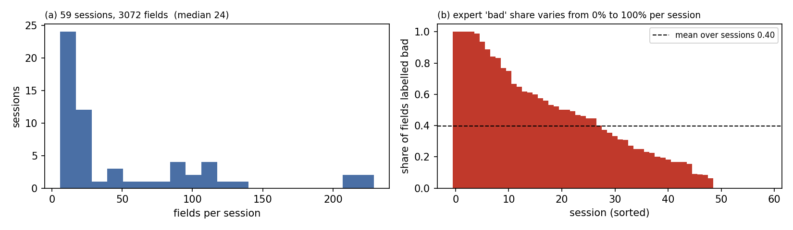
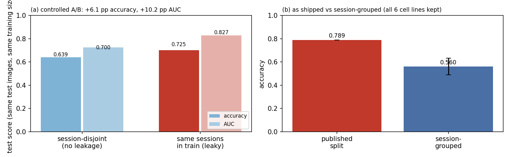
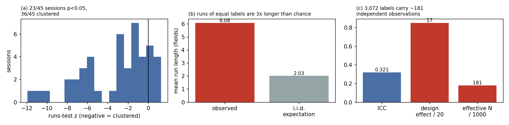
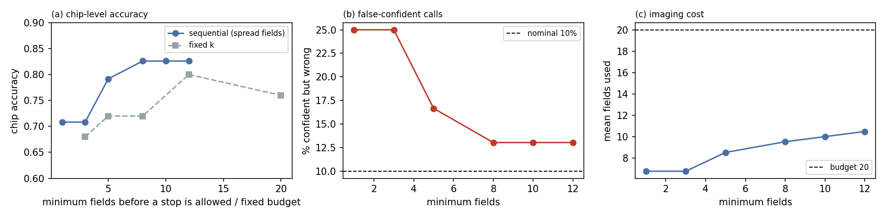
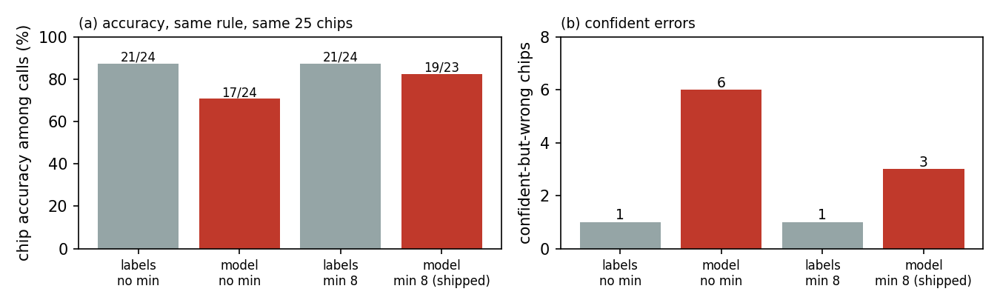

# When is one field enough?

**A measurement audit of an organ-on-a-chip quality-control benchmark, a corrected evaluation
protocol, and a chip-level QC tool with an explicit "inconclusive" outcome.**

*Category: Tool & Platform* — AI4S Open Innovation (AI + Organ-on-a-Chip), 2026.

---

## Summary

Organ-on-a-chip (OoC) cultures are inspected daily under a microscope, and the quality-control
(QC) decision — keep the chip, re-image, or discard it — is still made by eye. A public benchmark
exists for automating this: the **OOC Image Dataset** (3,072 brightfield fields, 59 acquisition
sessions, six cell lines, labels from four expert cell biologists by majority vote). Before
building on it we asked a simple question: *is this benchmark measuring what it claims to measure?*

It is not, in three specific and measurable ways.

1. **The published split leaks sessions.** Training and test images come from the *same 57 of 59
   sessions*. Holding the test images and the training-set size fixed, and changing only whether
   the test sessions also contribute training images, moves accuracy by **+8.2 pp (95% CI
   6.0–10.4) and AUC by +9.6 pp (95% CI 8.4–10.8)** across eight seeds. The shipped split reports
   78.9%; the same model on unseen sessions reports 56.0%.
2. **The 3,072 labels are not 3,072 independent observations.** Labels are strongly autocorrelated
   along the acquisition order (session ICC 0.321, mean run length 6.08 fields versus 2.03 under
   independence). The design effect is 17, so the benchmark carries the information of roughly
   **181 independent labels** — and a single field agrees with the session's majority label only
   **78.8%** of the time (91.0% even with ten fields).
3. **The failure mode is spatial, not per-image — and our own policy comparison did not survive
   its own criticism.** Failures occupy contiguous stretches of a chip (runs test significant in
   23/45 mixed sessions, surviving a cell-type control). A policy comparison simulated on the
   *labels* suggests random fields are best for the chip call; **with the model in the loop that
   ranking disappears** — every paired difference over 13–15 chips has a bootstrap CI containing
   zero (§4.3). What does survive is a concrete, reproducible failure: reading the **first** *k*
   fields called a 100%-bad chip *pass* with 0.94 confidence, because the start of a session can
   sit inside a good region. The shipped tool samples fields spread across the chip for that
   reason, not on the strength of a policy ranking.

4. **The leakage is not unique to this benchmark.** Auditing a second public organoid imaging
   benchmark (OCT organoid tracking, zenodo.15783866) shows the same defect: **40.0% of its test
   files belong to a (well, day) acquisition group that also appears in training** (§4.4).

We then built the tool the corrected protocol implies. Fields are sampled **spread across the
chip** (reading the first *k* can sit inside a good region and stop early — we observed a 100%-bad
chip called *pass* with 0.94 confidence), and a sequential stopping rule returns **pass / fail /
inconclusive** with a posterior confidence. On 25 unseen chips: **82.6% chip-level accuracy among
confident calls, 13% confident-but-wrong, 8% inconclusive, 9.5 fields on average** — versus 12
fields for a fixed budget at the same accuracy.

We also report two things we could not do, because they define the honest boundary of this work:
the **re-image vs discard** distinction is *not* supported by the data (a constructed recovery
target is not predictable; CV AUC 0.613 against a permutation null of 0.564), and **no reliable
out-of-distribution detector** was found (image statistics and feature-space distance both missed
the worst failure). Finally, simulating decision rules on ground-truth labels — as is common —
**overstates** deployed performance by a wide margin (6.6 fields at 94% in simulation versus 9.5
fields at 82.6% in deployment).

Everything is reproducible from one public dataset with the scripts in this repository.

---

## 1. Introduction

### 1.1 The problem

Microphysiological systems — organ-on-a-chip, organoids in microfluidic devices — are promoted as
human-relevant alternatives to animal testing. Their practical bottleneck is not the biology but
the *bookkeeping*: a chip is imaged repeatedly over days, and at each session someone must decide
whether the field in front of them is usable. Technical artifacts (air bubbles, defocus, deformed
channel walls) and biological problems (cells not attaching, density far from the expected range)
both appear as "bad", and both are judged by eye, field by field.

Automating this judgement is attractive, and a public benchmark for it exists. But an automated QC
system inherits every property of its benchmark: if the benchmark's split leaks, reported accuracy
is inflated; if its labels are clustered, its effective sample size is far smaller than it looks;
if its labels are field-dependent, then "accuracy per image" is not the quantity a lab actually
needs. None of these properties are usually checked.

### 1.2 What this report does

We take one public OoC QC benchmark — the OOC Image Dataset [1,2] — and treat the benchmark itself
as the object of study. We (i) audit its split and label structure, (ii) derive and validate a
corrected evaluation protocol, (iii) measure how sampling and aggregation policies behave on the
measured structure, and (iv) build and honestly evaluate a chip-level QC tool.

### 1.3 What we claim — and what we do not

We claim **measurement results** about a specific benchmark and a **protocol/tool** that follows
from them. We do *not* claim a new model architecture, biological or clinical validity, or
generalisation beyond this dataset. Leakage and label clustering are known phenomena in machine
learning [7,8,9,10,11]; our contribution is not their discovery but their **measured magnitude in
this benchmark, the corrected protocol, and the field-sampling policy that the measured structure
implies** — together with two negative results that bound the claims.

---

## 2. Data

**Source.** OOC Image Dataset, Zenodo record `10.5281/zenodo.10203721`; data descriptor in *Data*
2024 [1] and a companion conference paper [2]. The Zenodo record states **CC-BY-4.0**; the MDPI
descriptor lists **CC-BY-SA**. We resolve the ambiguity conservatively: we redistribute no images
(only 24 example fields for the demo, with attribution), license our code MIT and our derived
artefacts CC-BY-SA.

**Content.** 3,072 brightfield images (2,056 × 1,542 px) from an automated microscope on an OoC
setup, covering six cell lines (A549, Caco-2, HPMEC, HUVEC, NHBE, HSAEC). Filenames are
`YYMMDD_N.png`: `YYMMDD` identifies an **acquisition session** (59 in total) and `N` the field
number within it. Each image carries a binary label, `good` or `bad`, assigned by **four expert
cell biologists**, with disagreement resolved by majority vote or an additional rater [1].
Metadata (cell type, seeding density, flow rate, day after seeding) is available for part of the
data. Figure 1 summarises the corpus: sessions range from 3 to 229 fields (median 24), and the
share of fields labelled `bad` ranges from 0% to 100% per session.


*Figure 1. The corpus. (a) fields per session; (b) per-session share of fields labelled `bad`.*

**The published split.** The zip ships `train/val/test` folders (2,130 / 286 / 656 images). This is
the split used by the reference baseline in [1].

---

## 3. Methods

All quantities below are defined once here and used unchanged throughout; the scripts that compute
them are named in §7.

**Sessions and fields.** A *session* is one acquisition date (`YYMMDD` in the filename) — one
microscope run over one or more chips. A *field* is one image. We treat the field index `N` as the
acquisition order; the proxy is supported by the high correlation between consecutive fields
(§4.2). A *run* is a maximal contiguous block of equal labels in field order.

**Runs test (clustering).** For a binary sequence with `n₁` bad and `n₀` good fields, the number of
runs `R` has, under independence, mean `μ = 2n₁n₀/n + 1` and variance
`σ² = 2n₁n₀(2n₁n₀ − n) / (n²(n − 1))`; we report `z = (R − μ)/σ` and the two-sided normal p-value.
Negative `z` means fewer runs than chance, i.e. clustering. Sessions without both labels are
skipped. The i.i.d. expected run length is `1 / (2p(1−p))` with `p` the observed good fraction.

**Intraclass correlation and design effect.** For clusters (sessions) with sizes `n_i`, ICC(1) is
estimated by one-way ANOVA, `ICC = (MSB − MSW) / (MSB + (m₀ − 1)·MSW)` with
`m₀ = (N − Σn_i²/N)/(k − 1)`; the design effect is `1 + (m₀ − 1)·ICC` and the effective sample size
is `N / design effect`. This is the standard cluster-sampling treatment of "images within a chip".

**Controlled leakage A/B.** Test images are fixed by choosing 20 sessions and withholding half of
each session's fields as the test set. The other half of those sessions' fields are *available* but
used only in the leaky arm. Both arms receive exactly `N` training fields: the disjoint arm draws
all `N` from non-test sessions; the leaky arm draws `N − k` from non-test sessions and `k` from the
available test-session fields. Model, budget, augmentation and seeds are identical.

**Chip-level decision.** For a set of fields with per-field bad probabilities `p_j`, the sequential
rule maintains a Beta(1,1) posterior on the bad fraction `f` — `f | data ~ Beta(1 + b, 1 + g)` with
`b`, `g` the counts of fields with `p_j > 0.5` and `≤ 0.5` — and stops as soon as
`P(f > 0.5) > 0.9` or `P(f < 0.5) > 0.9`, at most after a budget of 20 fields and never before
`min_fields`. If the budget is exhausted with `0.35 < P(f > 0.5) < 0.65`, the call is
**inconclusive** rather than forced.

**Spread-field order.** With `n` available fields and a budget of `k`, the rule inspects indices
`round(i·(n−1)/(k−1))` for `i = 0…k−1`, i.e. fields spaced evenly across the acquisition order. This
replaces "the first `k` fields" after the failure described in §6.2.

**Metrics.** *Field accuracy* is the fraction of fields whose predicted side of 0.5 matches the
expert label. *Chip reference* is the session's majority label. *Chip accuracy among confident
calls* counts only calls the rule made with posterior confidence ≥ 0.9; *false-confident rate* is
the fraction of all chips that received a confident but wrong call; *inconclusive rate* is the
fraction that exhausted the budget near 0.5. *Bad-region recall* (sampling simulations) is the
fraction of the session's bad fields that the sampled set contains.

**Evaluation discipline.** Every model number in this report comes from a **session-disjoint** test
set of 25 sessions (684 fields). Where we also report the shipped split's number, it is labelled as
such. Hyperparameters were fixed before the final evaluation; no test-set tuning was performed.

---

## 4. Audit

### 4.1 The published split leaks sessions

**Observation.** Parsing the archive's central directory shows the split is image-level: sessions
are not held out. **Train contains 59 sessions, validation 51, test 57, and train ∩ test = 57 of
59 sessions** — images of the same chip, acquired in the same session, appear on both sides.

**Controlled measurement.** A plain comparison of splits confounds leakage with differences in test
composition, so we hold everything else fixed:

* the **test images** are identical in both arms (20 sessions, 521–712 fields);
* the **training-set size is identical** in the two arms (1,440–1,823 fields depending on the seed);
* the **model and budget are identical** (MobileNetV3-small, ImageNet-initialised, 6 epochs, 224 px);
* the only difference is whether the training set may use *the other images of the test sessions*
  (leaky) or must come from disjoint sessions (disjoint).

| arm | accuracy | AUC |
|---|---|---|
| session-disjoint | **67.2%** (± 6.2) | **0.750** |
| same sessions in training (leaky) | **75.4%** (± 6.8) | **0.846** |
| **inflation** (paired, 8 seeds) | **+8.2 pp** [6.0, 10.4] | **+9.6 pp** [8.4, 10.8] |


*Figure 2. (a) controlled A/B (8 seeds; paired inflation +8.2 pp accuracy, +9.6 pp AUC); (b) the shipped split versus a session-grouped split.*

For reference, the shipped split yields **78.9% ± 0.07 / AUC 0.873** (seed-to-seed variation is
tiny because all test sessions are seen in training), while a session-grouped split that keeps all
six cell lines yields **56.0% ± 7.2 / AUC 0.684** — a 22.9 pp gap that mixes leakage with the small
number of held-out sessions (six). We therefore treat the **controlled A/B as the headline number**
and report the shipped/grouped pair only as context.

**Why this matters for the benchmark.** Any model compared on the shipped split is compared on a
test set whose sessions it has already seen. Model *rankings* may survive (the leak affects all
models similarly), but the *absolute* numbers, and any claim of "generalisation to new chips", do
not.

### 4.2 Labels are clustered along the acquisition order

**Runs test.** For each session we take the label sequence in field order and count runs (maximal
contiguous blocks of equal label). Under independence the expected run length is
`1 / (2 p (1-p))`; with `p ≈ 0.56` that is **2.03** fields. Observed: **6.08**. A Wald–Wolfowitz
test is significant (p < 0.05) in **23 of the 45 mixed sessions**, and 36/45 have negative z
(clustered) — against 22.5 expected by chance. The most extreme session has z = −10.3 (27 runs
where 82.5 were expected, 229 fields).

| session | fields | good share | runs | expected runs | z | p |
|---|---|---|---|---|---|---|
| 221010 | 99 | 0.82 | 13 | 30.5 | -5.97 | <1e-6 |
| 230109 | 107 | 0.80 | 14 | 34.8 | -6.43 | <1e-6 |
| 230314 | 50 | 0.44 | 3 | 25.6 | -6.57 | <1e-6 |
| 230315 | 94 | 0.55 | 13 | 47.5 | -7.23 | <1e-6 |
| 230317 | 100 | 0.73 | 10 | 40.4 | -7.78 | <1e-6 |
| 230320 | 229 | 0.77 | 27 | 82.5 | -10.34 | <1e-6 |
| 230419 | 124 | 0.07 | 2 | 16.0 | -10.71 | <1e-6 |
| 230424 | 108 | 0.51 | 21 | 55.0 | -6.57 | <1e-6 |

*Table 1. The eight most clustered sessions (all p < 1e-6). Expected runs are what independence would give for the same good/bad counts.*

**This is not a cell-type artifact.** A session can contain several cell types imaged in contiguous
blocks, which would create clustering for trivial reasons. Restricting the test to *maximal
contiguous same-cell-type stretches*, **38 of 72 stretches remain significant** (57/72 clustered).

**It is not duplicate frames either.** Downscaled correlation between consecutive fields is 0.63 on
average (random pairs: 0.09–0.38), i.e. consecutive fields are spatially adjacent — but a greedy
view-clustering at r > 0.95 finds **1,161 distinct views among 1,183 images (98%)**. The clustering
is therefore not redundancy; **failures occupy contiguous regions of the chip**.

**Effective sample size.** With a session-level intraclass correlation of **ICC = 0.321** and a mean
cluster size of ~51 fields, the design effect is `1 + (m−1)·ICC = 17.0`, so for estimating a metric
the benchmark carries the information of roughly **3,072 / 17 ≈ 181 independent labels** (a model
may still exploit correlated fields in ways an estimator cannot, so this is a bound on
*estimation*, not on learning). The mean lag-1 autocorrelation
is 0.32 (53% of sessions above 0.3).


*Figure 3. (a) runs-test z per session; (b) observed versus i.i.d. run length; (c) ICC, design
effect and effective sample size.*

Agreement degrades with culture age and is cell-line dependent:

| culture age | fields | single-field agreement |
|---|---|---|
| 0-1_days | 852 | 0.805 |
| 2-3_days | 798 | 0.779 |
| 4+_days | 1199 | 0.676 |
| 4_days | 223 | 0.704 |

| cell line | fields | single-field agreement |
|---|---|---|
| A549 | 775 | 0.710 |
| CACO | 346 | 0.792 |
| HPMEC | 1462 | 0.702 |
| HSAEC | 244 | 0.840 |
| HUVEC | 107 | 0.991 |
| NHBE | 138 | 0.826 |

*Table 2. Single-field agreement with the session's majority label, by culture age and cell line. Late cultures are the hardest, and no cell line is uniformly easy.*

**Consequence for labels, not just for statistics.** If the label were a property of the chip, a
single field would predict the session's majority label almost perfectly. It does not: a single
field agrees with the session majority **78.8%** of the time, three fields 84.1%, five 87.4%, and
even ten fields only **91.0%**. Agreement is worse for late cultures (4+ days: 67.6% for a single
field) than for day 0–1 (80.5%). The "quality" of a chip is therefore **a property of a region and
of the sampling**, not of an image.

### 4.3 Sampling policy: a comparison that does not survive the model in the loop

If failures are contiguous, how should fields be chosen? We first simulate three policies on the
measured **label sequences** at a fixed budget *k* (300 trials per session):

* **random** — *k* distinct uniform fields;
* **window** — one contiguous run of *k* fields (a scan);
* **adaptive** — start at a random field; if it was `bad`, expand to an unsampled neighbour; if
  `good`, jump elsewhere.

| budget k | random: acc / recall / err | window: acc / recall / err | adaptive: acc / recall / err |
|---|---|---|---|
| 2 | 0.822 / 0.095 / 0.182 | 0.812 / 0.096 / 0.222 | 0.808 / 0.105 / 0.206 |
| 4 | 0.860 / 0.196 / 0.119 | 0.833 / 0.188 / 0.174 | 0.838 / 0.214 / 0.153 |
| 8 | 0.907 / 0.351 / 0.074 | 0.886 / 0.328 / 0.129 | 0.851 / 0.391 / 0.120 |
| 12 | 0.920 / 0.429 / 0.055 | 0.891 / 0.413 / 0.106 | 0.849 / 0.474 / 0.110 |
| 20 | 0.922 / 0.402 / 0.046 | 0.876 / 0.380 / 0.107 | 0.789 / 0.482 / 0.137 |

*Table 3. Label-based policy simulation. `err` = |estimated − true bad fraction|. Random looks best
for the call and adaptive best for localisation — and we do not believe this table.*

This is exactly the practice criticised in §6.5, so we repeat the comparison with the deployed
model's per-field probabilities on the 25 session-disjoint test chips
(`audit/03c_policy_model_in_loop.py`):

| budget k | random: acc / recall | window: acc / recall | adaptive: acc / recall |
|---|---|---|---|
| 4 | 0.791 / 0.335 | 0.785 / 0.321 | 0.772 / 0.323 |
| 8 | 0.789 / 0.300 | 0.818 / 0.311 | 0.776 / 0.296 |
| 12 | 0.800 / 0.393 | 0.818 / 0.389 | 0.840 / 0.397 |

*Table 4. The same policies with the model in the loop. The ordering changes, and no difference is
significant: a paired bootstrap over chips (2,000 resamples) gives 95% intervals of [−0.08, +0.00]
for random − adaptive at k=12 (13 chips), [−0.12, +0.07] for window − adaptive and [−0.11, +0.07]
for random − window — all contain zero (Figure 4c).*

**We therefore report no policy ranking.** With only 13–15 chips large enough for these budgets the
comparison is underpowered, and the label-based ranking is an artefact of scoring policies against
the very labels they were designed to sample.

What *is* established, and what the tool uses, is a single reproducible failure of the obvious
default. Reading the **first** *k* fields in acquisition order with the sequential rule of §6.1
called a 100%-bad chip (session 230405) *pass* with 0.94 confidence: the per-field probabilities in
the first third of that session are low (mean 0.255 over the first five fields, versus 0.935 over
the last twenty). Sampling fields spread across the chip fixes that case (the same chip returns
*fail*, P = 0.91); on the 11 chips with at least 20 fields the accuracy difference (0.727 vs 0.636)
is ±1 chip and is not significant either. The justification for spread sampling is the observed
failure, not a measured ranking.

### 4.4 The same defect in a second organoid benchmark

To test whether the leakage we measure is a property of one dataset or of the field, we audited a
second public organoid imaging benchmark: the **OCT organoid segmentation-and-tracking dataset**
(zenodo.15783866, CC-BY-4.0, *Diagnostics* 2024). Its file names encode the acquisition group —
`w<well>_d<day>_<slice>.png` in train/val and `d<day>_p<plate>_w<well>_<slice>.png` in test — and the
same (well, day) means the same organoids imaged in the same session. Reading the archive's central
directory over HTTP range requests (no 4.9 GB download; `audit/06_oct_leakage.py`):

* train: 16,752 files in **8** (well, day) groups; val: 4,188 files in 2 groups; test: 20,940 files in 10 groups
* **train ∩ test = 4 groups** — well 2 at days 5, 7, 11 and 13; val ∩ test = 1 group
* **40.0% of test files (8,376 of 20,940) belong to a (well, day) group that also appears in training**

For a *tracking* benchmark this is more severe than for classification: the same organoid instances,
imaged in the same session at the same timepoint, appear on both sides of the split. We report the
structural overlap rather than a re-trained inflation number, because re-training their
segmentation/tracking pipeline is out of scope here.

Two datasets, two independent instances of the same defect — group-level splits that leak — which is
the empirical basis for the first rule of the corrected protocol (§5).

### 4.5 A hypothesis we tested and rejected: re-image vs discard

The dataset's own definition of `bad` mixes **technical artifacts** (bubbles, defocus, deformed
walls) with **biological problems** (morphology/density off expectation) [1]. If these could be
separated, the actionable output would be "re-image" (cheap, the chip survives) versus "discard"
(expensive, re-imaging is useless). Two observations encouraged the attempt: isolated bad runs are
blurrier and darker than good fields (Laplacian 0.089 vs 0.124; dark fraction 0.137 vs 0.091 —
bubbles and defocus), whereas long bad runs have normal focus but higher contrast; and visually,
4/4 sampled isolated-bad fields showed bubbles or defocus.

We constructed a target — a run "recovers" if the next five fields are majority `good` — and tried
to predict it from features available at decision time (run length, whether the run reaches the end
of the session, focus, darkness, artifact scores), with **session-grouped cross-validation**.

| feature set | CV AUC |
|---|---|
| run length only | 0.476 |
| artifact signals only | 0.381 |
| run length + artifacts | 0.539 |
| all features | 0.613 |
| permutation null | mean 0.479, p95 **0.564** |
| simple rule (length ≤ 2 ⇒ recover) | accuracy 0.560 vs base rate **0.624** |

**The decision rule is not supported.** The target is confounded by position (because failures are
contiguous, the fields after a run are usually good, so "recovery" largely means "the run did not
reach the end"), and — more fundamentally — **no re-imaging was ever performed in this dataset, so
the causal question cannot be observed**. We therefore ship `pass`/`fail`/`inconclusive` and
document the two-mode observation as an *open problem*, not a feature.

### 4.6 Aggregation rules are a sensitivity/specificity dial

If several fields are read, their scores must be combined. We compare three rules on per-field
probabilities from a session-disjoint model, at a fixed field threshold chosen on validation, with
the chip reference defined as before:

| budget k | mean: acc / sens / spec | max: acc / sens / spec | top-2: acc / sens / spec |
|---|---|---|---|
| 1 | 0.704 / 0.456 / 0.832 | 0.704 / 0.456 / 0.832 | 0.704 / 0.456 / 0.832 |
| 3 | 0.691 / 0.475 / 0.803 | 0.699 / 0.691 / 0.704 | 0.709 / 0.610 / 0.760 |
| 5 | 0.678 / 0.493 / 0.767 | 0.626 / 0.686 / 0.598 | 0.627 / 0.574 / 0.653 |
| 8 | 0.742 / 0.645 / 0.787 | 0.627 / 0.878 / 0.507 | 0.660 / 0.787 / 0.598 |
| 12 | 0.742 / 0.851 / 0.710 | 0.570 / 1.000 / 0.354 | 0.631 / 0.997 / 0.452 |

*Table 5. Aggregation rules (25 unseen chips; the same sampled fields for every rule).*

`mean` maximises chip accuracy and keeps specificity high; `max` maximises sensitivity (it calls
almost everything bad: specificity collapses to 0.35 at k=12) and `top-2` sits between. **The
aggregation rule moves the operating point more than the per-field model does** — at k=12, accuracy
ranges from 0.570 to 0.742 and sensitivity from 0.851 to 1.000 depending only on the rule. A QC
deployment must therefore state its aggregation rule; "accuracy" without it is not a specification.

We also tested a rule that exploits the measured autocorrelation — smoothing the per-field scores
along the acquisition order before aggregating. It did **not** help (chip accuracy 0.676 → 0.642 at
k=6 for a 5-field moving average): smoothing suppresses exactly the sharp block edges that carry
the signal. Reported as a negative result.

### 4.7 Metadata does not explain the labels

A logistic model on day, log seeding density, flow rate and cell line reaches only 0.562 in-sample
accuracy, and apparent cell-line differences (Caco-2 68.5% bad vs NHBE 23.9%) dissolve on
inspection: every cell line has sessions with a 0% bad rate and sessions with 100%. The label is
dominated by **session-level** variation, consistent with §4.2.

---

## 5. Corrected evaluation protocol

From the audit, three rules follow for anyone training or benchmarking on this dataset:

1. **Split by session, not by image.** No session may contribute to two splits. Report the number
   of held-out sessions alongside the metric — with 59 sessions, a 20% held-out split is ~12
   sessions and the confidence interval on chip-level accuracy is correspondingly wide.
2. **Evaluate at the chip level.** Report (i) per-field accuracy/AUC *and* (ii) chip-level accuracy
   with the number of fields used, because per-field numbers do not answer the lab's question and
   are inflated by within-session correlation (effective N ≈ 181, not 3,072).
3. **State the sampling policy.** Which fields were used, and how many. Policies differ in
   principle (§4.3) and we could not rank them with this benchmark's 59 sessions; a number is only
   interpretable together with the policy that produced it.

As a worked example, `audit/01_split_audit.py` and `evaluate.py` reproduce every number in this
report from the raw dataset.

---

## 6. The tool

### 6.1 Design

`inference.py` takes the fields of one chip (filenames in acquisition order) and returns:

* **per-field P(bad)** from a MobileNetV3-small (ImageNet-initialised, 384 px, 25 epochs, cosine
  LR, label smoothing, random-resized-crop/flip augmentation), trained on a **session-disjoint**
  split (1,495 train / 200 val / 684 test fields from 25 unseen sessions);
* a **chip call** — `pass`, `fail`, or `inconclusive` — from a Beta(1,1) posterior on the bad
  fraction, stopping when `P(chip bad) > 0.9` or `< 0.1`;
* **how many fields were needed**, with fields chosen **spread across the chip** rather than the
  first *k*;
* a **QC map** (field index vs P(bad)) and a `chip_report.json`.

**Model and training.** MobileNetV3-small, ImageNet-initialised, classifier head replaced with a
2-way linear layer. Input 384 × 384 (the source images are 2,056 × 1,542). AdamW (lr 3e-4, weight
decay 0.02), cosine schedule to lr/30, label smoothing 0.05, batch 32, 25 epochs
(≈14 s/epoch on one RTX 3090, ≈6 min total), RandomResizedCrop(0.7–1.0) + horizontal/vertical
flips. Label smoothing and the modest capacity are deliberate: the labels are four-rater
majorities, and 3,072 fields with an effective N of ~181 do not support a large model. The
checkpoint is shipped in `model/`.

### 6.2 Two bugs found during deployment (and why they matter)

Deploying the tool on real chips exposed two failure modes that a label-only simulation had hidden.

**(a) Reading the first *k* fields is wrong.** On a 100%-bad chip, walking the first fields in
acquisition order stopped after three `good` predictions and returned *pass* with 0.94 confidence.
Because failures are contiguous (§4.2), the beginning of a session can lie inside a good region.
Sampling fields spread across the chip fixed this specific case (the same chip now returns *fail*
at 0.91).

**(b) The Beta posterior is overconfident on few fields.** With three `good` fields and no `bad`
one, `P(chip bad) = 0.0625` — "94% confident" — which is indefensible when the per-field model is
imperfect. Requiring a minimum of eight fields before a stop is allowed cut the false-confident
rate from 25% to 13%.

### 6.3 Measured performance (25 unseen chips, 684 fields)

| metric | value |
|---|---|
| per-field accuracy / AUC | 0.734 / 0.791 |
| chip accuracy, all fields, mean | 0.80 |
| **chip accuracy among confident calls** (spread fields, min 8, conf 0.9) | **0.826** (95% Wilson CI 0.63–0.93, n=23) |
| **false-confident calls** (confident and wrong) | **13%** |
| inconclusive (budget exhausted near P = 0.5) | 8% |
| mean fields used | **9.5** (fixed budget of 12 gives 0.80) |


*Figure 5. Tool behaviour versus the minimum-fields guard.*

**Capacity is not the bottleneck.** We trained a 2.4× larger backbone (MobileNetV3-large, same
384 px, same protocol). Test field accuracy moved from 0.734 to 0.746 and balanced accuracy from
0.733 to 0.747, while AUC *fell* from 0.791 to 0.788 — i.e. a larger model buys nothing here
(`audit/perfield_model.py --arch large`). Together with the session-level domain shift in §6.4 this
suggests the ceiling is set by the labels and by chip-to-chip appearance, not by model capacity.
We therefore ship the smaller model, which is also cheaper to run.

### 6.4 Where the tool fails

Chip-level failures are not spread evenly; they cluster in a few sessions, and they are not flagged
by the model's own confidence. The clearest case is session 230405 (69 fields, **100%** labelled
bad): the model is right on 82.6% of its fields individually, yet the per-field probabilities in
the first third of the session are low (mean 0.255 over the first five fields versus 0.935 over the
last twenty), so an unguarded rule stopped early with a confident *pass*.

| chip (session) | fields | true bad share | per-field accuracy |
|---|---|---|---|
| 220706 | 5 | 100% | 0.200 |
| 220718 | 4 | 100% | 0.750 |
| 220721 | 3 | 100% | 1.000 |
| 230405 | 69 | 100% | 0.826 |
| 230403 | 6 | 83% | 0.167 |
| 230314 | 25 | 64% | 0.720 |
| 230512 | 44 | 61% | 0.795 |
| 230529 | 108 | 59% | 0.769 |
| 230523 | 55 | 55% | 0.582 |
| 220606 | 10 | 50% | 0.200 |
| 230425 | 107 | 49% | 0.673 |
| 230315 | 47 | 47% | 0.638 |
| 230215 | 12 | 42% | 0.583 |
| 220506 | 7 | 29% | 0.857 |
| 220715 | 7 | 29% | 0.429 |
| 230123 | 13 | 23% | 0.692 |
| 220515 | 6 | 17% | 0.833 |
| 230109 | 53 | 13% | 0.792 |
| 230214 | 24 | 12% | 0.667 |
| 220502 | 4 | 0% | 1.000 |
| 220620 | 6 | 0% | 1.000 |
| 220716 | 4 | 0% | 0.750 |
| 230119 | 35 | 0% | 0.971 |
| 230316 | 22 | 0% | 1.000 |
| 230321 | 8 | 0% | 1.000 |

*Table 6. The 25 unseen test chips, sorted by the true share of bad fields. The three 100%-bad
chips with tiny field counts (220706, 220718, 220721) are the hardest; the model is also wrong on
230403 (83% bad, 6 fields).*

**Out-of-distribution detection failed.** We tested two standard detectors against the training
chips: a Mahalanobis distance on four image statistics (mean, standard deviation, Laplacian focus
proxy, dark fraction) and a Mahalanobis distance in the model's 576-dimensional penultimate feature
space. The image-statistics detector flags almost nothing; the feature-space detector flags almost
everything (16 of 25 sessions above the training 99th percentile), and **neither flags session
230405**, the worst failure. We therefore do not present an OOD alarm as a safety feature; the
distance is exposed as a diagnostic only.

**What this means in practice.** The tool is usable as a *screening* aid with a human in the loop,
not as an autonomous gate. Its measured error rate (13% confident-but-wrong) is the number to quote
in any deployment decision.

### 6.5 Generalisation to a cell line the model has never seen

The session-disjoint protocol of §6.3 keeps all six cell lines in training. To measure a stricter
setting we hold out one cell line entirely — test = all of its fields, train = the other five with
any session containing the held-out line removed — and retrain the deployed configuration
(`audit/05_lolo_cellline.py`):

| held-out cell line | test fields (sessions) | accuracy | balanced acc | AUC |
|---|---|---|---|---|
| A549 | 775 (24) | 0.712 | 0.661 | 0.678 |
| CACO | 346 (17) | 0.512 | 0.611 | 0.666 |
| HPMEC | 1462 (29) | 0.589 | 0.605 | 0.659 |
| HUVEC | 107 (4) | 0.879 | 0.874 | 0.930 |
| NHBE | 138 (6) | 0.601 | 0.499 | 0.630 |
| HSAEC | 244 (21) | 0.730 | 0.723 | 0.753 |
| **mean of the six** | 3,072 (101) | **0.670** | 0.662 | **0.719** |
| in-distribution (all lines seen, §6.3) | 684 (25) | 0.734 | 0.733 | 0.791 |

*Table 7. Leave-one-cell-line-out. The spread between cell lines (AUC 0.630–0.930) is larger than
the effect of any modelling choice we tested — a 2.4× larger backbone or 512 px inputs change
nothing (§6.3).*

**Deploying on a new cell line costs about seven AUC points on average and up to 22 accuracy
points** (Caco-2), and the per-line variation dominates. This is the strictest evaluation we have;
we keep the session-disjoint protocol as the headline because it matches how such a tool would be
used (a new chip of a known cell line), but any deployment to an unseen line needs re-calibration
on that line.

### 6.6 Label-only simulation overstates deployed performance

A common practice — which we followed first — is to simulate a decision policy on **ground-truth
labels**. Doing so with this dataset's labels gives an attractive result: 6.6 fields on average,
94.1% chip accuracy, 3.7% false-confident. Measured with the deployed model, the same policy gives
**9.5 fields, 82.6% accuracy and 13% false-confident**. The optimistic gap comes from two sources:
per-field model errors (AUC 0.791, not 1.0) and the stopping rule's interaction with them.


*Figure 6. The same policy, simulated on labels versus measured in deployment.*

**Recommendation for the field:** evaluate QC decision policies **with the model in the loop**. A
label-only simulation measures the policy, not the system.

---

## 7. Discussion

**For benchmark authors.** The three defects we measure are cheap to check and were not checked
here: a session-level (or patient-level, or chip-level) split; a design-effect estimate for the
label; and a per-image agreement statistic between a single sample and the group's consensus. We
suggest reporting all three alongside the usual accuracy, because they change what the number
means. In this benchmark the effective sample size is 6% of the nominal one, and a model trained on
the shipped split is evaluated on chips it has already seen.

**For laboratories.** The practical consequence of clustered failures is that *which* fields are
imaged matters: the same rule reads the same chip correctly or not depending on whether it looks at
the beginning of the acquisition order or across the whole chip. We could not establish a general
ranking between random, scan and adaptive sampling with 59 sessions (§4.3), so the tool uses spread
sampling to avoid the specific failure we observed rather than as an optimised policy. Its cost
(9.5 fields on average) is modest; its error rate (13% confident-but-wrong) is the number that
matters in a deployment decision.

**For method developers.** The largest single lesson is in Figure 6: a decision policy evaluated on
ground-truth labels looked excellent (6.6 fields, 94.1% accuracy, 3.7% false-confident) and
collapsed once the model was in the loop (9.5 fields, 82.6%, 13%). The gap is not a bug in the
policy; it is what happens when per-field errors interact with an early-stopping rule. QC papers
that report policy numbers from label simulations should be read with this in mind, and we
recommend model-in-the-loop evaluation as the default.

**Open problem.** The dataset's own definition of `bad` mixes technical artifacts with biological
failure, which suggests the actionable output should be "re-image" versus "discard". We tried and
failed to validate that mapping (§4.5): the causal question cannot be observed without actual
re-imaging. A dataset that images each chip twice — before and after a re-imaging attempt — would
settle it, and would be a small, valuable addition to this benchmark.

## 8. Limitations

1. **13% of confident calls are wrong** on unseen chips. This is a research prototype, not a
   validated instrument; a chip should not be discarded on its output alone.
2. **No reliable out-of-distribution detector.** We tested image-statistics distance and
   feature-space Mahalanobis distance against the training chips; both failed to flag the worst
   case (the 100%-bad chip called *pass* with 0.94 confidence). The tool exposes the distance as a
   diagnostic only.
3. **The re-image/discard recommendation is not validated** (§4.5) and is not part of the tool's
   output.
4. **One dataset, 25 test chips.** Chip-level metrics carry wide confidence intervals; we report
   them as point estimates with the split size. No wet-lab validation was performed, and we make no
   biological or clinical claim — the claim is about *measurement validity*.
5. **Sampling policies could not be ranked.** The label-based comparison (§4.3, Table 3) is
   underpowered when repeated with the model in the loop (13–15 chips; all paired CIs include
   zero). We report the policy we use and the failure that motivates it, not a ranking.
6. **Labels come from a four-rater majority**, so the ceiling of any model on this benchmark is the
   agreement among experts, which is not public. Our numbers are therefore a lower bound in that
   specific sense, while the leakage inflation is an upper-bound problem.
7. **Generalisation to a new cell line is untested in deployment.** Held-out cell lines cost
   ~7 AUC points on average (0.791 → 0.719) and the spread between lines dominates every modelling
   choice we tested (§6.5). The tool is validated for cell lines it has seen.
8. **The acquisition order is used as a proxy for spatial order.** Consecutive fields are highly
   correlated (r = 0.63 vs 0.09–0.38 for random pairs), which supports the proxy, but the exact
   stage geometry is not public.

---

## 9. Reproducibility

```bash
# data (not redistributed here)
curl -L -o ooc.zip "https://zenodo.org/api/records/10203721/files/OOC_image_dataset.zip/content"
python3 -c "import zipfile; zipfile.ZipFile('ooc.zip').extractall('.')"   # unzip(1) fails on this zip64

python3 audit/leakage_controlled.py     # +8.2 pp / +9.6 pp (finding 1, 8 seeds)
python3 audit/block_structure.py        # ICC 0.321, effective N ≈ 181 (finding 2)
python3 audit/structure_probe.py        # runs test (finding 3)
python3 audit/adaptive_sampling.py      # policy comparison (finding 4)
python3 audit/recovery_test.py          # negative result (finding 5)
python3 evaluate.py                     # deployed-tool numbers (§6.3)
python3 figures.py                      # every figure in this report
python3 demo/app.py                     # interactive demo
```

Every number in this report is written to `results/*.json` by the script that produced it.

---

## 10. Related work

**Leakage in benchmarks.** Split leakage is a known and actively studied class of problem: Ramos et
al. audit leakage across seven visual datasets and measure its effect on downstream evaluation [7];
whole-slide-image benchmarks have been shown to leak at patient *and* institution level, inflating
accuracy by several points [8]; OCT classification was shown to be inflated by improper splitting
[9]. Tooling exists for near-duplicate detection and grouped splitting [10,11]. Our finding is a
new instance of this class, with the magnitude measured in an OoC QC benchmark by a controlled A/B.

**Clustered labels and effective sample size.** Treating images as correlated clusters when
computing power or sample size is standard in imaging study design [12], and effective sample size
under autocorrelation is textbook. We apply these tools to field-level QC labels and quantify the
consequence for a benchmark (≈181 independent labels).

**Microscopy QC.** Automated QC for high-throughput microscopy has its own benchmarks and methods
(e.g. AutoQC-Bench, 2025 [13]); classical QC metrics for microscopy images are long established
[14]. Our contribution is complementary: not a new QC metric, but a measurement audit and a
sampling/decision policy for chip-level QC.

**Organoid/OoC imaging benchmarks.** Several organoid imaging datasets exist (detection,
segmentation, tracking), including multi-rater annotation [15]. None, to our knowledge, ship a
chip-level QC protocol; the field-dependence we measure is a property of this label definition.

---

## 11. Conclusion

A public benchmark for organ-on-a-chip quality control reports per-image accuracy on a split that
leaks sessions (+8.2 pp measured by controlled A/B, 8 seeds), with labels that are clustered along the
acquisition order (ICC 0.321; effective N ≈ 181 of 3,072) and field-dependent (a single field
agrees with the session majority 78.8% of the time). Correcting the protocol — session-grouped
splits, chip-level evaluation, explicit sampling policy — and sampling fields spread across the
chip yields a tool that reaches 82.6% chip-level accuracy among confident calls with 9.5 fields on
average, and says "inconclusive" when it cannot decide. Two negative results bound the claims: the
re-image/discard distinction is not supported by this data, and no reliable OOD detector was found.
Simulating the same decision policy on ground-truth labels overstates its deployed performance
(94% vs 82.6%), a caution that generalises beyond this benchmark.

**Future work.** (i) Extend the model-in-the-loop versus label-only comparison to a second dataset
and modality (we have begun with a patient-derived-organoid drug-response dataset); (ii) a
calibrated stopping rule that accounts for the measured design effect; (iii) prospective validation
of the two-mode (transient vs persistent) hypothesis with actual re-imaging.

---

## References

[1] Movčana, V., Strods, A., Narbute, K., et al. Organ-On-A-Chip (OOC) Image Dataset for Machine
Learning and Tissue Model Evaluation. *Data* 2024, 9, 28. DOI 10.3390/data9020028.
[2] Companion conference paper, DOI 10.23919/SPA59660.2023.10274460.
[3] Dataset: OOC Image Dataset, Zenodo, DOI 10.5281/zenodo.10203721 (CC-BY-4.0 per Zenodo record;
CC-BY-SA per [1]).
[7] Ramos, P., Ramos, R., Garcia, N. Data Leakage in Visual Datasets. arXiv:2508.17416 (ICCV 2025
Workshop Findings).
[8] Auditing Data Leakage in Whole-Slide Image Multimodal Benchmarks. arXiv:2607.12278.
[9] Tampu, I. E., et al. Inflation of test accuracy due to data leakage in deep learning-based
classification of OCT images. *Scientific Data* 2022.
[10] `leakaudit` (R package) — near-duplicate detection and corrected split assignment.
[11] Group-aware splitting (GroupShuffleSplit) — standard grouped-split tooling.
[12] Designing image segmentation studies: statistical power, sample size and reference standard
quality. *Medical Image Analysis* (PMC5666910).
[13] Pan, Z., et al. AutoQC-Bench: a diffusion model and benchmark for automatic quality control in
high-throughput microscopy. 2025 (PMC12594752).
[14] Bray, M.-A., et al. Workflow and metrics for image quality control in large-scale
high-content screens. *J. Biomol. Screen.* 2012.
[15] MultiOrg: A Multi-rater Organoid-detection Dataset. NeurIPS 2024 Datasets & Benchmarks.

*Code licence MIT; derived artefacts CC-BY-SA; dataset images not redistributed.*
